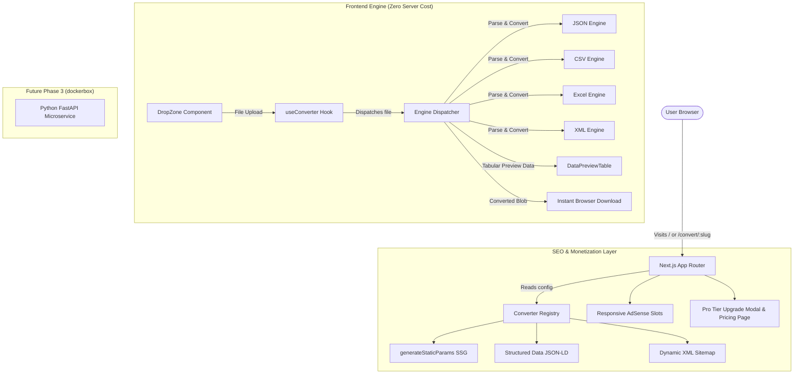

# ConvertSheet MVP Implementation Plan

> **For agentic workers:** REQUIRED SUB-SKILL: Use superpowers:subagent-driven-development to implement this plan task-by-task. Steps use checkbox (`- [ ]`) syntax for tracking.

**Goal:** Build and launch the Phase 1 & 2 MVP of ConvertSheet (`convertsheet.com`), featuring a high-speed browser-first conversion engine, programmatic SEO pages for the first 7 high-traffic converters, clean tech UI with live preview, and monetization architecture (AdSense & Pro subscriptions).

**Architecture:** Monorepo containing a Next.js 14+ frontend with SOLID, decoupled client-side conversion engines (`xlsx`, `papaparse`, `fast-xml-parser`) delivering 0 server costs for files under 5MB. Programmatic SEO dynamically statically generates (SSG) all 7 high-intent converter landing pages (`/convert/[slug]`) complete with Google Rich Snippet JSON-LD schemas (`SoftwareApplication`, `HowTo`, `FAQPage`) and an automated sitemap.

**Architecture Diagram:**



**Tech Stack:** Next.js 14+ (App Router), TypeScript, Tailwind CSS, Lucide React, SheetJS (`xlsx`), PapaParse, fast-xml-parser, Vitest (for engine unit tests).

---

### Task 1: Monorepo Foundation & Next.js Setup

**Files:**
- Create: `frontend/package.json`
- Create: `frontend/tsconfig.json`
- Create: `frontend/tailwind.config.ts`
- Create: `frontend/postcss.config.mjs`
- Create: `frontend/next.config.mjs`
- Create: `frontend/vitest.config.ts`
- Create: `frontend/src/app/globals.css`

- [ ] **Step 1: Create `frontend/package.json` with required dependencies**

```json
{
  "name": "convertsheet-frontend",
  "version": "0.1.0",
  "private": true,
  "scripts": {
    "dev": "next dev",
    "build": "next build",
    "start": "next start",
    "lint": "next lint",
    "test": "vitest run"
  },
  "dependencies": {
    "clsx": "^2.1.1",
    "fast-xml-parser": "^4.4.1",
    "lucide-react": "^0.439.0",
    "next": "^14.2.10",
    "papaparse": "^5.4.1",
    "react": "^18.3.1",
    "react-dom": "^18.3.1",
    "tailwind-merge": "^2.5.2",
    "xlsx": "https://cdn.sheetjs.com/xlsx-0.20.3/xlsx-0.20.3.tgz"
  },
  "devDependencies": {
    "@types/node": "^20.16.5",
    "@types/papaparse": "^5.3.14",
    "@types/react": "^18.3.5",
    "@types/react-dom": "^18.3.5",
    "autoprefixer": "^10.4.20",
    "postcss": "^8.4.45",
    "tailwindcss": "^3.4.11",
    "typescript": "^5.6.2",
    "vitest": "^2.1.1"
  }
}
```

- [ ] **Step 2: Create TypeScript, Tailwind, PostCSS, Next, and Vitest configs**
Create `frontend/tsconfig.json`, `frontend/tailwind.config.ts`, `frontend/postcss.config.mjs`, `frontend/next.config.mjs`, `frontend/vitest.config.ts`, and `frontend/src/app/globals.css` with emerald/tech dark styling.

- [ ] **Step 3: Run `npm install` inside `frontend/`**
Run: `npm install --prefix frontend`  
Expected: Dependencies installed with zero errors.

- [ ] **Step 4: Commit**
```bash
git add frontend/
git commit -m "chore: scaffold frontend Next.js application structure"
```

---

### Task 2: Core Interfaces & Conversion Engines (TDD)

**Files:**
- Create: `frontend/src/types/converter.ts`
- Create: `frontend/src/lib/engines/csv-engine.ts`
- Create: `frontend/src/lib/engines/json-engine.ts`
- Create: `frontend/src/lib/engines/excel-engine.ts`
- Create: `frontend/src/lib/engines/xml-engine.ts`
- Create: `frontend/src/lib/engines/index.ts`
- Test: `frontend/src/lib/engines/__tests__/engines.test.ts`

- [ ] **Step 1: Define `frontend/src/types/converter.ts`**
Define `TabularData`, `ConversionOptions`, `ConversionOutput`, and `IConverterEngine` interfaces.

- [ ] **Step 2: Write failing unit test `frontend/src/lib/engines/__tests__/engines.test.ts`**
Write tests asserting:
1. `csvEngine.parsePreview` extracts columns and rows from CSV text.
2. `csvEngine.convert` outputs valid XLSX buffer for CSV input.
3. `jsonEngine.parsePreview` flattens nested objects into tabular structure.
4. `jsonEngine.convert` converts JSON array to Excel workbook.
5. `xmlEngine.parsePreview` extracts repeated nodes from XML into tabular preview.

- [ ] **Step 3: Run test to verify it fails**
Run: `npm test --prefix frontend`  
Expected: FAIL with "Cannot find module '../index'" or missing engines.

- [ ] **Step 4: Implement engines in `frontend/src/lib/engines/`**
Implement:
- `csv-engine.ts`: Uses PapaParse for robust parsing (with delimiter detection), and SheetJS for Excel output.
- `json-engine.ts`: Implements recursive key-flattening (`flattenObject`) and converts objects $\leftrightarrow$ sheets.
- `excel-engine.ts`: Uses SheetJS (`XLSX.read`, `XLSX.utils.sheet_to_json`, `sheet_to_csv`) for bi-directional Excel conversions.
- `xml-engine.ts`: Uses `XMLParser` to extract records and serialize to tabular rows.
- `index.ts`: Central `getConverterEngine(engineId)` factory.

- [ ] **Step 5: Run tests to verify they pass**
Run: `npm test --prefix frontend`  
Expected: All tests PASS.

- [ ] **Step 6: Commit**
```bash
git add frontend/src/types/ frontend/src/lib/engines/
git commit -m "feat(engine): implement SOLID conversion engines with unit tests"
```

---

### Task 3: Converter Registry & Utility Functions

**Files:**
- Create: `frontend/src/types/registry.ts`
- Create: `frontend/src/lib/registry.ts`
- Create: `frontend/src/lib/utils.ts`
- Test: `frontend/src/lib/__tests__/registry.test.ts`

- [ ] **Step 1: Write test verifying registry data completeness**
Test that `CONVERTER_REGISTRY` contains all 7 target routes (`json-to-excel`, `xml-to-excel`, `csv-to-excel`, `excel-to-json`, `excel-to-csv`, `pdf-to-excel`, `tally-xml-to-excel`), each with non-empty titles, FAQs, and how-to steps.

- [ ] **Step 2: Implement `frontend/src/lib/utils.ts`**
Add `cn()` helper, `formatBytes(bytes)`, `downloadBlob(blob, filename)`, and `getFileExtension(filename)`.

- [ ] **Step 3: Implement `frontend/src/lib/registry.ts`**
Export `CONVERTER_REGISTRY`, `getAllConverterSlugs()`, `getConverterBySlug(slug)`, and list of featured converters.

- [ ] **Step 4: Run test to verify it passes**
Run: `npm test --prefix frontend`  
Expected: PASS.

- [ ] **Step 5: Commit**
```bash
git add frontend/src/lib/
git commit -m "feat(registry): add converter registry and utilities"
```

---

### Task 4: Converter Hook & Reusable Components

**Files:**
- Create: `frontend/src/hooks/useConverter.ts`
- Create: `frontend/src/components/converter/DropZone.tsx`
- Create: `frontend/src/components/converter/DataPreviewTable.tsx`
- Create: `frontend/src/components/converter/FormatSelector.tsx`
- Create: `frontend/src/components/converter/ConverterCard.tsx`
- Create: `frontend/src/components/converter/ProUpgradeModal.tsx`

- [ ] **Step 1: Implement `frontend/src/hooks/useConverter.ts`**
Orchestrates file reading, invoking engine preview, running conversion, triggering download, and checking file size limit (10MB) to prompt the Pro upgrade modal.

- [ ] **Step 2: Implement `DropZone.tsx`**
Modern dashed drag-and-drop dropzone with file picker, format badges, and drag-over visual feedback.

- [ ] **Step 3: Implement `DataPreviewTable.tsx`**
Clean 10-row tabular grid showing columns, row numbers, and emerald badges for loaded cells.

- [ ] **Step 4: Implement `FormatSelector.tsx` and `ProUpgradeModal.tsx`**
Dropdowns for target formats and an elegant modal that triggers when file size $>10\text{MB}$ or batch mode is requested.

- [ ] **Step 5: Implement `ConverterCard.tsx`**
Composes DropZone, Preview, options, and "Convert & Download" button into the unified card container matching our design mockup.

- [ ] **Step 6: Commit**
```bash
git add frontend/src/hooks/ frontend/src/components/converter/
git commit -m "feat(ui): build converter UI components and useConverter hook"
```

---

### Task 5: Layout, Navigation, Footer, and Monetization Ad Slots

**Files:**
- Create: `frontend/src/components/layout/Navbar.tsx`
- Create: `frontend/src/components/layout/Footer.tsx`
- Create: `frontend/src/components/layout/AdBanner.tsx`
- Create: `frontend/src/app/layout.tsx`

- [ ] **Step 1: Implement `Navbar.tsx`**
Brand logo with emerald spreadsheet icon, "Tools" dropdown linking to the 7 converters, "API", "Pricing", and a prominent "👑 Pro" upgrade button.

- [ ] **Step 2: Implement `Footer.tsx`**
Categorized directory of converters, trust badges ("100% Client-Side Private", "No Server Uploads"), privacy policy and terms links.

- [ ] **Step 3: Implement `AdBanner.tsx`**
Clean, responsive Google AdSense container with standard IAB dimensions (e.g. 728x90 leaderboard, 300x250) and graceful development placeholder.

- [ ] **Step 4: Update `frontend/src/app/layout.tsx`**
Provide unified layout with font configurations, metadata base, Navbar, AdBanner slots, and Footer.

- [ ] **Step 5: Commit**
```bash
git add frontend/src/components/layout/ frontend/src/app/layout.tsx
git commit -m "feat(layout): implement global layout, navbar, footer, and ad slots"
```

---

### Task 6: Programmatic SEO Dynamic Routes (`/convert/[slug]`)

**Files:**
- Create: `frontend/src/components/seo/HowToGuide.tsx`
- Create: `frontend/src/components/seo/FAQAccordion.tsx`
- Create: `frontend/src/components/seo/JsonLdSchema.tsx`
- Create: `frontend/src/app/convert/[slug]/page.tsx`
- Create: `frontend/src/app/sitemap.ts`
- Create: `frontend/src/app/robots.ts`

- [ ] **Step 1: Implement SEO Components**
- `HowToGuide.tsx`: 3-step visual workflow (Upload, Preview & Configure, Download).
- `FAQAccordion.tsx`: Clean accordion answering search intent queries.
- `JsonLdSchema.tsx`: Injects `SoftwareApplication`, `HowTo`, and `FAQPage` schemas into the `<head>` for rich snippet ranking.

- [ ] **Step 2: Implement dynamic page `frontend/src/app/convert/[slug]/page.tsx`**
- `generateStaticParams()`: Exports all slugs from `CONVERTER_REGISTRY` for SSG compilation.
- `generateMetadata()`: Injects title, description, OpenGraph tags, and canonical URL.
- Renders `ConverterCard` with current tool config, followed by `AdBanner`, `HowToGuide`, and `FAQAccordion`.

- [ ] **Step 3: Implement dynamic sitemap and robots**
- `sitemap.ts`: Generates XML sitemap containing `/`, `/pricing`, and all `/convert/[slug]` routes.
- `robots.ts`: Allows full indexing and links to `/sitemap.xml`.

- [ ] **Step 4: Commit**
```bash
git add frontend/src/components/seo/ frontend/src/app/convert/ frontend/src/app/sitemap.ts frontend/src/app/robots.ts
git commit -m "feat(seo): implement programmatic SSG converter pages and structured schemas"
```

---

### Task 7: Homepage & Pricing Page

**Files:**
- Create: `frontend/src/app/page.tsx`
- Create: `frontend/src/app/pricing/page.tsx`

- [ ] **Step 1: Implement `frontend/src/app/page.tsx`**
- Hero headline matching design: "Fast, Private Structured Data Converter".
- Universal converter card supporting drag-and-drop of any supported file type with auto-detection.
- "Popular Converters" grid featuring direct cards to the 7 MVP converters.
- Value proposition section: "Why ConvertSheet?" (100% Client-Side Privacy, Lightning Fast, Zero Data Storage, Developer API).

- [ ] **Step 2: Implement `frontend/src/app/pricing/page.tsx`**
- Tier comparison table:
  - Free ($0/mo): Up to 10MB per file, 100% browser private, all standard formats.
  - Pro ($9.99/mo): Up to 100GB files, batch conversions, auto 15-minute file wipe guarantee, priority processing.
  - Developer API ($19.99/mo): 10,000 monthly conversions, Python/Node SDKs, webhook support, 99.9% uptime SLA.
- Stripe checkout CTA buttons with direct hooks.

- [ ] **Step 3: Commit**
```bash
git add frontend/src/app/page.tsx frontend/src/app/pricing/
git commit -m "feat(pages): implement homepage with universal converter and pricing page"
```

---

### Task 8: Backend Skeleton (`backend/`)

**Files:**
- Create: `backend/requirements.txt`
- Create: `backend/Dockerfile`
- Create: `backend/README.md`
- Create: `backend/app/main.py`

- [ ] **Step 1: Create FastAPI skeleton in `backend/`**
Setup `requirements.txt` (`fastapi`, `uvicorn`, `pandas`, `openpyxl`, `pdfplumber`, `xmltodict`), minimal `main.py` with `/health` and placeholder `/convert/pdf` endpoints, `Dockerfile`, and setup instructions for `dockerbox` Cloudflare Tunnel deployment.

- [ ] **Step 2: Commit**
```bash
git add backend/
git commit -m "chore(backend): scaffold FastAPI service skeleton for Phase 3"
```

---

### Task 9: End-to-End Build & Verification

**Files:**
- Test execution across all engines and Next.js SSG build.

- [ ] **Step 1: Run unit test suite**
Run: `npm test --prefix frontend`  
Expected: All engine tests pass.

- [ ] **Step 2: Run Next.js production build**
Run: `npm run build --prefix frontend`  
Expected: Static Site Generation succeeds, pre-rendering `/`, `/pricing`, `/sitemap.xml`, and all 7 `/convert/[slug]` routes.

- [ ] **Step 3: Verify dev server and interactive file conversion**
Start server: `npm run dev --prefix frontend`  
Verify:
- Converting sample JSON to XLSX generates valid `.xlsx` file.
- Converting CSV to XLSX generates valid `.xlsx` file.
- Converting XLSX to JSON/CSV extracts data correctly.
- File $>10\text{MB}$ triggers Pro Upgrade modal.
- Structured data JSON-LD validates against Schema.org specs.

- [ ] **Step 4: Final commit**
```bash
git commit --allow-empty -m "chore: verify build and client-side conversion engine suite"
```
