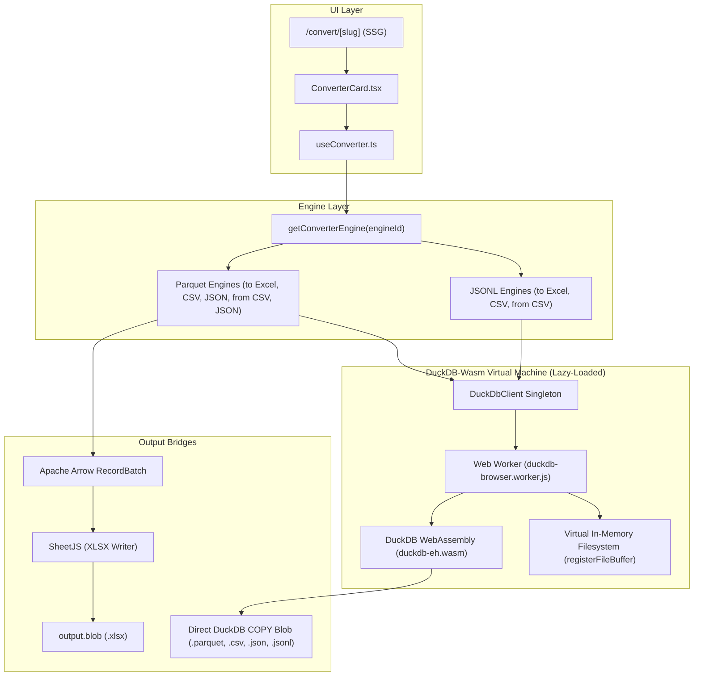

# DuckDB-Wasm Engine (Parquet & JSONL) Implementation Plan

> **For agentic workers:** REQUIRED SUB-SKILL: Use superpowers:subagent-driven-development to implement this plan task-by-task. Steps use checkbox (`- [ ]`) syntax for tracking.

**Goal:** Integrate `@duckdb/duckdb-wasm` into ConvertSheet to unlock 8 high-demand, client-side data engineering converters (Parquet $\leftrightarrow$ Excel/CSV/JSON, JSONL $\leftrightarrow$ Excel/CSV) running 100% in-browser with zero server compute costs, lazy-loaded Wasm bundles, and programmatic SEO SSG routes.

**Architecture:** A lazy-loaded, Web Worker-isolated `DuckDbClient` singleton manages virtual filesystem memory and runs analytical queries. Dedicated converter engines (`ParquetToExcelEngine`, `ParquetToCsvEngine`, `ParquetToJsonEngine`, `CsvToParquetEngine`, `JsonToParquetEngine`, `JsonlToExcelEngine`, `JsonlToCsvEngine`, `CsvToJsonlEngine`) implement the existing `IConverterEngine` interface, compiling data in WebAssembly and streaming native files via SheetJS and Arrow buffers. Next.js dynamically code-splits the Wasm binaries so the core homepage and landing pages remain under 100 kB.

**Architecture Diagram:**



**Tech Stack:**
- `@duckdb/duckdb-wasm` & `apache-arrow`
- `xlsx` (SheetJS)
- Next.js 14 App Router with Dynamic Imports (`next/dynamic` / `import()`)
- Vitest & `@testing-library/react`

---

## User Review Required

> [!IMPORTANT]
> **Wasm Bundle Strategy:** DuckDB-Wasm requires its `.wasm` and `.worker.js` binaries. We will configure DuckDB-Wasm to load bundles via jsdelivr CDN with local fallback in `public/duckdb/`. The Wasm engine is strictly lazy-loaded on demand when a user opens a Parquet or JSONL route, keeping initial page load ultra-fast.
>
> **Scope Expansion:** This implementation adds 8 new converters, taking ConvertSheet from **7 to 15 total production routes**:
> 1. `parquet-to-excel` (.parquet $\to$ .xlsx)
> 2. `parquet-to-csv` (.parquet $\to$ .csv)
> 3. `parquet-to-json` (.parquet $\to$ .json)
> 4. `csv-to-parquet` (.csv $\to$ .parquet)
> 5. `json-to-parquet` (.json $\to$ .parquet)
> 6. `jsonl-to-excel` (.jsonl $\to$ .xlsx)
> 7. `jsonl-to-csv` (.jsonl $\to$ .csv)
> 8. `csv-to-jsonl` (.csv $\to$ .jsonl)

---

## Proposed Changes

Grouped by component layer and ordered by dependency order.

### 1. Dependencies & Infrastructure Layer

#### [MODIFY] [package.json](file:///Users/priyanshu/Desktop/convertsheet/frontend/package.json)
- Add `@duckdb/duckdb-wasm` and `apache-arrow` to `dependencies`.

#### [NEW] [duckdb-client.ts](file:///Users/priyanshu/Desktop/convertsheet/frontend/src/lib/engines/duckdb-client.ts)
- Implement `DuckDbClient` class with singleton pattern.
- Methods:
  - `getDb(): Promise<AsyncDuckDB>` (lazy-initializes only when called).
  - `registerBuffer(filename: string, buffer: Uint8Array): Promise<void>`
  - `dropFile(filename: string): Promise<void>`
  - `queryTabular(sql: string, maxRows?: number): Promise<TabularData>`
  - `exportBuffer(sql: string, outputFilename: string): Promise<Uint8Array>`
- Graceful error handling for corrupt Parquet or invalid JSONL syntax.

#### [NEW] [duckdb-client.test.ts](file:///Users/priyanshu/Desktop/convertsheet/frontend/src/lib/engines/__tests__/duckdb-client.test.ts)
- Unit tests for `DuckDbClient` lifecycle, buffer registration, and error handling.

---

### 2. Conversion Engines Layer

#### [NEW] [parquet-engine.ts](file:///Users/priyanshu/Desktop/convertsheet/frontend/src/lib/engines/parquet-engine.ts)
- Implement:
  - `ParquetToExcelEngine` (`engineId: "parquet-to-excel"`)
  - `ParquetToCsvEngine` (`engineId: "parquet-to-csv"`)
  - `ParquetToJsonEngine` (`engineId: "parquet-to-json"`)
  - `CsvToParquetEngine` (`engineId: "csv-to-parquet"`)
  - `JsonToParquetEngine` (`engineId: "json-to-parquet"`)
- Preview: reads first $N$ rows using `SELECT * FROM read_parquet(?) LIMIT ?`.
- Convert:
  - For Excel: pulls Arrow table into SheetJS workbook.
  - For CSV/JSON/Parquet: leverages DuckDB's high-speed internal `COPY (...) TO ... (FORMAT ...)` directly into virtual memory.

#### [NEW] [jsonl-engine.ts](file:///Users/priyanshu/Desktop/convertsheet/frontend/src/lib/engines/jsonl-engine.ts)
- Implement:
  - `JsonlToExcelEngine` (`engineId: "jsonl-to-excel"`)
  - `JsonlToCsvEngine` (`engineId: "jsonl-to-csv"`)
  - `CsvToJsonlEngine` (`engineId: "csv-to-jsonl"`)
- Preview: uses `SELECT * FROM read_json_auto(?, format='newline_delimited') LIMIT ?`.
- Convert: transforms into Excel, CSV, or exports newline-delimited JSON with `(FORMAT JSON, ARRAY FALSE)`.

#### [MODIFY] [frontend/src/lib/engines/index.ts](file:///Users/priyanshu/Desktop/convertsheet/frontend/src/lib/engines/index.ts)
- Register new engines in `ENGINE_MAP` and export instances.

#### [NEW] [parquet-jsonl-engines.test.ts](file:///Users/priyanshu/Desktop/convertsheet/frontend/src/lib/engines/__tests__/parquet-jsonl-engines.test.ts)
- Comprehensive test battery covering:
  - Parquet to Excel/CSV/JSON
  - CSV/JSON to Parquet (and verifying the resulting Parquet file can be read back)
  - JSONL to Excel/CSV and CSV to JSONL
  - Corrupt file handling and empty inputs

---

### 3. Registry, SEO & Navigation Layer

#### [MODIFY] [frontend/src/types/converter.ts](file:///Users/priyanshu/Desktop/convertsheet/frontend/src/types/converter.ts)
- Update `ConverterEngineId` union type with:
  `"parquet-to-excel" | "parquet-to-csv" | "parquet-to-json" | "csv-to-parquet" | "json-to-parquet" | "jsonl-to-excel" | "jsonl-to-csv" | "csv-to-jsonl"`.

#### [MODIFY] [frontend/src/lib/registry.ts](file:///Users/priyanshu/Desktop/convertsheet/frontend/src/lib/registry.ts)
- Add complete `ConverterConfig` entries for all 8 new routes:
  - Optimized SEO titles, subtitles, and meta descriptions.
  - At least 3 detailed FAQs per tool addressing data engineering, PyArrow, Databricks, and Python workflows.
  - 3-step visual How-To guides.
  - Accepted MIME types (`application/vnd.apache.parquet`, `application/x-ndjson`, etc.).

#### [MODIFY] [frontend/src/components/layout/Navbar.tsx](file:///Users/priyanshu/Desktop/convertsheet/frontend/src/components/layout/Navbar.tsx)
- Group Tools dropdown into clean categorized sections: **Spreadsheets** (CSV, Excel, XML) and **Data Engineering** (Parquet, JSON, JSONL).

#### [MODIFY] [frontend/src/app/page.tsx](file:///Users/priyanshu/Desktop/convertsheet/frontend/src/app/page.tsx)
- Add category filter pills or tabbed grid ("All", "Spreadsheets", "Data Engineering") to display all 15 converters cleanly.

---

## Verification Plan

### Automated Tests
1. **Unit & Engine Tests:**
   ```bash
   npm test --prefix frontend
   ```
   - Verifies all 160 existing tests continue to pass.
   - Verifies 20+ new tests for DuckDB, Parquet, and JSONL engines.
2. **ESLint & TypeScript Typecheck:**
   ```bash
   npm run lint --prefix frontend
   npx tsc --noEmit --project frontend/tsconfig.json
   ```
3. **Static Generation Production Build:**
   ```bash
   npm run build --prefix frontend
   ```
   - Must generate all **22 static pages** (15 converter routes + home + pricing + robots + sitemap).

### Manual Verification
1. Open [http://localhost:5050/convert/parquet-to-excel](http://localhost:5050/convert/parquet-to-excel).
2. Upload a sample `.parquet` file, verify live 10-row preview renders in tabular format, click "Convert & Download", and open the resulting `.xlsx` in Excel / Numbers.
3. Open [http://localhost:5050/convert/jsonl-to-excel](http://localhost:5050/convert/jsonl-to-excel), upload sample `.jsonl`, convert and verify columns.
4. Verify bundle size and initial load time remain under 100 kB on homepage.
