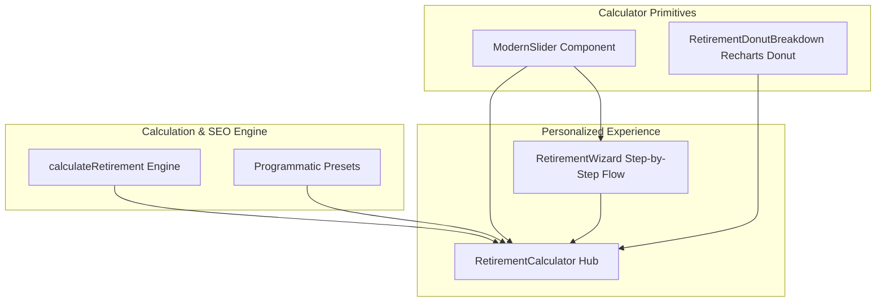

# Modern & Personalized Financial Calculator UX Implementation Plan

> **For agentic workers:** REQUIRED SUB-SKILL: Use superpowers:subagent-driven-development to implement this plan task-by-task. Steps use checkbox (`- [ ]`) syntax for tracking.

**Goal:** Transform ConvertSheet's financial calculators into a tactile, modern, and personalized wealth-planning experience with custom interactive sliders, quick preset chips, guided onboarding wizard, and visual donut breakdown.

**Architecture:** We build a reusable `ModernSlider` component with twin slider + numeric input and preset chips. We then construct a modular `RetirementWizard` for step-by-step personalized onboarding, a `RetirementDonutBreakdown` chart component, and refactor `RetirementCalculator` to seamlessly integrate both guided wizard mode and full live playground mode.

**Architecture Diagram:**



**Tech Stack:** Next.js 14, React 18, TypeScript, Tailwind CSS, Lucide React, Recharts, Vitest, Testing Library.

---

### Task 1: Create Reusable `ModernSlider` Component

**Files:**
- Create: `frontend/src/components/calculator/ModernSlider.tsx`
- Create: `frontend/src/components/calculator/__tests__/ModernSlider.test.tsx`
- Modify: `frontend/src/components/calculator/index.ts`

- [ ] **Step 1: Write the failing tests for `ModernSlider`**

```tsx
// frontend/src/components/calculator/__tests__/ModernSlider.test.tsx
import React from "react";
import { render, screen, fireEvent } from "@testing-library/react";
import { describe, it, expect, vi } from "vitest";
import { ModernSlider } from "../ModernSlider";

describe("ModernSlider", () => {
  const defaultProps = {
    id: "test-age",
    label: "Current Age",
    value: 30,
    min: 18,
    max: 80,
    step: 1,
    suffix: "yrs",
    presets: [
      { label: "25", value: 25 },
      { label: "30", value: 30 },
      { label: "40", value: 40 },
    ],
    onChange: vi.fn(),
  };

  it("renders label, value, and preset chips", () => {
    render(<ModernSlider {...defaultProps} />);
    expect(screen.getByText("Current Age")).toBeInTheDocument();
    expect(screen.getByRole("slider")).toHaveValue("30");
    expect(screen.getByText("25")).toBeInTheDocument();
    expect(screen.getByText("40")).toBeInTheDocument();
  });

  it("calls onChange when slider value changes", () => {
    const onChange = vi.fn();
    render(<ModernSlider {...defaultProps} onChange={onChange} />);
    const slider = screen.getByRole("slider");
    fireEvent.change(slider, { target: { value: "35" } });
    expect(onChange).toHaveBeenCalledWith(35);
  });

  it("calls onChange when preset chip is clicked", () => {
    const onChange = vi.fn();
    render(<ModernSlider {...defaultProps} onChange={onChange} />);
    fireEvent.click(screen.getByText("40"));
    expect(onChange).toHaveBeenCalledWith(40);
  });
});
```

- [ ] **Step 2: Run test to verify failure**

Run: `npm test -- src/components/calculator/__tests__/ModernSlider.test.tsx`  
Expected: FAIL (file does not exist).

- [ ] **Step 3: Implement `ModernSlider.tsx`**

```tsx
// frontend/src/components/calculator/ModernSlider.tsx
"use client";

import React, { memo } from "react";

export interface SliderPreset {
  label: string;
  value: number;
}

export interface ModernSliderProps {
  id: string;
  label: string;
  value: number;
  min: number;
  max: number;
  step?: number;
  prefix?: string;
  suffix?: string;
  presets?: SliderPreset[];
  helpText?: string;
  onChange: (val: number) => void;
  className?: string;
}

export const ModernSlider = memo(function ModernSlider({
  id,
  label,
  value,
  min,
  max,
  step = 1,
  prefix = "",
  suffix = "",
  presets,
  helpText,
  onChange,
  className = "",
}: ModernSliderProps) {
  const percentage = Math.min(100, Math.max(0, ((value - min) / (max - min || 1)) * 100));

  return (
    <div className={`space-y-2.5 w-full ${className}`}>
      <div className="flex items-center justify-between">
        <label htmlFor={id} className="text-xs sm:text-sm font-semibold text-zinc-800 dark:text-zinc-200">
          {label}
        </label>
        <div className="relative flex items-center rounded-xl border border-zinc-200 dark:border-zinc-700 bg-zinc-50 dark:bg-zinc-800/80 px-2.5 py-1 shadow-2xs">
          {prefix && <span className="text-xs font-semibold text-zinc-500 dark:text-zinc-400 mr-1">{prefix}</span>}
          <input
            type="number"
            min={min}
            max={max}
            step={step}
            value={value}
            aria-label={`${label} numeric input`}
            onChange={(e) => {
              const num = Number(e.target.value);
              if (!isNaN(num)) onChange(num);
            }}
            className="w-16 sm:w-20 text-xs sm:text-sm font-bold font-mono text-emerald-700 dark:text-emerald-300 bg-transparent text-right focus:outline-hidden"
          />
          {suffix && <span className="text-xs font-semibold text-zinc-500 dark:text-zinc-400 ml-1">{suffix}</span>}
        </div>
      </div>

      <div className="relative flex items-center h-6">
        <input
          id={id}
          type="range"
          role="slider"
          min={min}
          max={max}
          step={step}
          value={value}
          aria-label={label}
          aria-valuenow={value}
          aria-valuemin={min}
          aria-valuemax={max}
          onChange={(e) => onChange(Number(e.target.value))}
          style={{
            background: `linear-gradient(to right, #10b981 0%, #10b981 ${percentage}%, #e4e4e7 ${percentage}%, #e4e4e7 100%)`,
          }}
          className="w-full h-2.5 rounded-lg appearance-none cursor-pointer accent-emerald-600 dark:accent-emerald-400 focus:outline-hidden focus:ring-2 focus:ring-emerald-500/20"
        />
      </div>

      {presets && presets.length > 0 && (
        <div className="flex flex-wrap items-center gap-1.5 pt-0.5">
          {presets.map((preset) => {
            const isActive = preset.value === value;
            return (
              <button
                key={preset.label}
                type="button"
                onClick={() => onChange(preset.value)}
                className={`px-2.5 py-1 text-[11px] font-mono font-medium rounded-lg transition-all ${
                  isActive
                    ? "bg-emerald-600 text-white font-bold shadow-2xs scale-105"
                    : "bg-zinc-100 dark:bg-zinc-800 text-zinc-600 dark:text-zinc-400 hover:bg-zinc-200 dark:hover:bg-zinc-700 hover:text-zinc-900 dark:hover:text-zinc-100 border border-zinc-200/60 dark:border-zinc-700/60"
                }`}
              >
                {prefix}
                {preset.label}
                {suffix && ` ${suffix}`}
              </button>
            );
          })}
        </div>
      )}

      {helpText && <p className="text-[11px] text-zinc-500 dark:text-zinc-400">{helpText}</p>}
    </div>
  );
});
```

- [ ] **Step 4: Export from `src/components/calculator/index.ts` and verify test passes**

Run: `npm test -- src/components/calculator/__tests__/ModernSlider.test.tsx`  
Expected: PASS (3 tests passed).

- [ ] **Step 5: Commit**

```bash
git add frontend/src/components/calculator/ModernSlider.tsx frontend/src/components/calculator/__tests__/ModernSlider.test.tsx frontend/src/components/calculator/index.ts
git commit -m "feat(ui): create reusable ModernSlider component with preset chips"
```

---

### Task 2: Create `RetirementDonutBreakdown` Component

**Files:**
- Create: `frontend/src/components/calculator/RetirementDonutBreakdown.tsx`
- Create: `frontend/src/components/calculator/__tests__/RetirementDonutBreakdown.test.tsx`
- Modify: `frontend/src/components/calculator/index.ts`

- [ ] **Step 1: Write failing test for `RetirementDonutBreakdown`**

```tsx
// frontend/src/components/calculator/__tests__/RetirementDonutBreakdown.test.tsx
import React from "react";
import { render, screen } from "@testing-library/react";
import { describe, it, expect } from "vitest";
import { RetirementDonutBreakdown } from "../RetirementDonutBreakdown";

describe("RetirementDonutBreakdown", () => {
  it("renders total nest egg and breakdown percentages", () => {
    render(
      <RetirementDonutBreakdown
        totalNestEgg={1000000}
        totalContributions={300000}
        totalInterestEarned={600000}
        employerMatchAmount={100000}
        retirementAge={65}
      />
    );
    expect(screen.getByText("$1,000,000")).toBeInTheDocument();
    expect(screen.getByText(/Personal Principal/i)).toBeInTheDocument();
    expect(screen.getByText(/Compound Growth/i)).toBeInTheDocument();
  });
});
```

- [ ] **Step 2: Run test to verify failure**

Run: `npm test -- src/components/calculator/__tests__/RetirementDonutBreakdown.test.tsx`  
Expected: FAIL.

- [ ] **Step 3: Implement `RetirementDonutBreakdown.tsx`**

```tsx
// frontend/src/components/calculator/RetirementDonutBreakdown.tsx
"use client";

import React, { memo } from "react";
import { PieChart, Pie, Cell, ResponsiveContainer, Tooltip } from "recharts";

export interface RetirementDonutProps {
  totalNestEgg: number;
  totalContributions: number;
  totalInterestEarned: number;
  employerMatchAmount?: number;
  retirementAge: number;
  className?: string;
}

export const RetirementDonutBreakdown = memo(function RetirementDonutBreakdown({
  totalNestEgg,
  totalContributions,
  totalInterestEarned,
  employerMatchAmount = 0,
  retirementAge,
  className = "",
}: RetirementDonutProps) {
  const data = [
    { name: "Personal Principal", value: totalContributions, color: "#3b82f6" },
    { name: "Compound Growth", value: totalInterestEarned, color: "#10b981" },
  ];

  if (employerMatchAmount > 0) {
    data.push({ name: "Employer Match", value: employerMatchAmount, color: "#14b8a6" });
  }

  const interestPercentage = totalNestEgg > 0 ? Math.round((totalInterestEarned / totalNestEgg) * 100) : 0;

  return (
    <div className={`p-5 sm:p-6 rounded-3xl border border-zinc-200 dark:border-zinc-800 bg-white dark:bg-zinc-900 shadow-xs space-y-4 ${className}`}>
      <div className="flex items-center justify-between border-b border-zinc-100 dark:border-zinc-800 pb-3">
        <h3 className="text-xs sm:text-sm font-bold uppercase tracking-wider text-zinc-700 dark:text-zinc-300">
          Nest Egg Distribution (Age {retirementAge})
        </h3>
        <span className="text-[11px] font-bold px-2 py-0.5 rounded-md bg-emerald-50 dark:bg-emerald-950/60 text-emerald-700 dark:text-emerald-300 border border-emerald-200/60 dark:border-emerald-800/60">
          {interestPercentage}% from Compounding
        </span>
      </div>

      <div className="relative h-56 flex items-center justify-center">
        <ResponsiveContainer width="100%" height="100%">
          <PieChart>
            <Tooltip
              formatter={(val: number) => [`$${val.toLocaleString()}`, "Amount"]}
              contentStyle={{
                backgroundColor: "#18181b",
                borderColor: "#27272a",
                borderRadius: "0.75rem",
                fontSize: "12px",
                color: "#fafafa",
              }}
            />
            <Pie
              data={data}
              innerRadius={65}
              outerRadius={88}
              paddingAngle={3}
              dataKey="value"
            >
              {data.map((entry) => (
                <Cell key={entry.name} fill={entry.color} />
              ))}
            </Pie>
          </PieChart>
        </ResponsiveContainer>

        {/* Center Text */}
        <div className="absolute inset-0 flex flex-col items-center justify-center pointer-events-none text-center">
          <span className="text-[11px] font-semibold text-zinc-400">Total at {retirementAge}</span>
          <span className="text-lg sm:text-xl font-extrabold font-mono text-zinc-900 dark:text-zinc-50">
            ${totalNestEgg.toLocaleString()}
          </span>
        </div>
      </div>

      {/* Legend Badges */}
      <div className="grid grid-cols-1 sm:grid-cols-2 gap-2 pt-2 text-xs">
        {data.map((item) => (
          <div key={item.name} className="flex items-center justify-between p-2 rounded-xl bg-zinc-50 dark:bg-zinc-800/50 border border-zinc-100 dark:border-zinc-800">
            <div className="flex items-center gap-2">
              <span className="w-2.5 h-2.5 rounded-full" style={{ backgroundColor: item.color }} />
              <span className="font-medium text-zinc-600 dark:text-zinc-400">{item.name}</span>
            </div>
            <span className="font-mono font-bold text-zinc-900 dark:text-zinc-100">
              ${item.value.toLocaleString()}
            </span>
          </div>
        ))}
      </div>
    </div>
  );
});
```

- [ ] **Step 4: Export and run tests**

Run: `npm test -- src/components/calculator/__tests__/RetirementDonutBreakdown.test.tsx`  
Expected: PASS.

- [ ] **Step 5: Commit**

```bash
git add frontend/src/components/calculator/RetirementDonutBreakdown.tsx frontend/src/components/calculator/__tests__/RetirementDonutBreakdown.test.tsx frontend/src/components/calculator/index.ts
git commit -m "feat(ui): create RetirementDonutBreakdown visual chart component"
```

---

### Task 3: Create `RetirementWizard` Step-by-Step Guided Flow

**Files:**
- Create: `frontend/src/components/calculator/RetirementWizard.tsx`
- Create: `frontend/src/components/calculator/__tests__/RetirementWizard.test.tsx`
- Modify: `frontend/src/components/calculator/index.ts`

- [ ] **Step 1: Write failing test for `RetirementWizard`**

```tsx
// frontend/src/components/calculator/__tests__/RetirementWizard.test.tsx
import React from "react";
import { render, screen, fireEvent } from "@testing-library/react";
import { describe, it, expect, vi } from "vitest";
import { RetirementWizard } from "../RetirementWizard";

describe("RetirementWizard", () => {
  const mockValues = {
    currentAge: 30,
    retirementAge: 65,
    currentSavings: 50000,
    monthlyContribution: 1000,
    postRetirementAnnualSpend: 60000,
  };

  it("renders Step 1 Timeline initially", () => {
    render(<RetirementWizard values={mockValues} onChange={vi.fn()} onFinish={vi.fn()} />);
    expect(screen.getByText(/Step 1 of 3: Your Timeline/i)).toBeInTheDocument();
    expect(screen.getByText(/Current Age/i)).toBeInTheDocument();
  });

  it("advances to Step 2 when Next is clicked", () => {
    render(<RetirementWizard values={mockValues} onChange={vi.fn()} onFinish={vi.fn()} />);
    fireEvent.click(screen.getByText(/Next: Savings Foundation/i));
    expect(screen.getByText(/Step 2 of 3: Financial Foundation/i)).toBeInTheDocument();
  });
});
```

- [ ] **Step 2: Run test to verify failure**

Run: `npm test -- src/components/calculator/__tests__/RetirementWizard.test.tsx`  
Expected: FAIL.

- [ ] **Step 3: Implement `RetirementWizard.tsx`**

Implement 3 progressive steps with timeline, foundation, and lifestyle inputs, back/next buttons, and seamless completion handoff.

- [ ] **Step 4: Export and run tests**

Run: `npm test -- src/components/calculator/__tests__/RetirementWizard.test.tsx`  
Expected: PASS.

- [ ] **Step 5: Commit**

```bash
git add frontend/src/components/calculator/RetirementWizard.tsx frontend/src/components/calculator/__tests__/RetirementWizard.test.tsx frontend/src/components/calculator/index.ts
git commit -m "feat(ui): add RetirementWizard step-by-step personalized onboarding"
```

---

### Task 4: Integrate Redesigned Experience into `RetirementCalculator`

**Files:**
- Modify: `frontend/src/components/tools/RetirementCalculator.tsx`
- Modify: `frontend/src/components/tools/__tests__/financial-crown-tools.test.tsx`

- [ ] **Step 1: Write integration tests for redesigned RetirementCalculator**

Verify:
1. Mode toggling between "Guided Journey" and "Live Playground".
2. Sliding ages and savings immediately updates the live Donut and Nest Egg total.
3. Accessible heading order and input labels remain 100% compliant.

- [ ] **Step 2: Update `RetirementCalculator.tsx`**
  - Integrate `ModernSlider` for Current Age, Retirement Age, Current Savings, and Monthly Contribution.
  - Integrate `RetirementDonutBreakdown` alongside results.
  - Provide a toggle at the top: `[Guided Journey (3-Step)]` / `[Full Playground]`.
  - Maintain full backward compatibility with programmatic presets (`200k-mortgage`, `retire-at-50-fire`, etc.).

- [ ] **Step 3: Run component tests**

Run: `npm test -- src/components/tools/__tests__/financial-crown-tools.test.tsx`  
Expected: PASS.

- [ ] **Step 4: Commit**

```bash
git add frontend/src/components/tools/RetirementCalculator.tsx frontend/src/components/tools/__tests__/financial-crown-tools.test.tsx
git commit -m "feat(calculator): upgrade RetirementCalculator to personalized slider & donut UX"
```

---

### Task 5: Full Automated Suite & Local A11y Audit Verification

**Files:**
- Run: `npm test`
- Run: `npm run build`
- Run: `npm run audit`

- [ ] **Step 1: Run complete test suite**

Verify all 45 test files pass 100%.

- [ ] **Step 2: Run static export build**

Ensure all 225 pages prerender cleanly.

- [ ] **Step 3: Run local auditor across all 123 pages**

Run: `npm run audit`  
Verify: 0 errors, 0 warnings.
