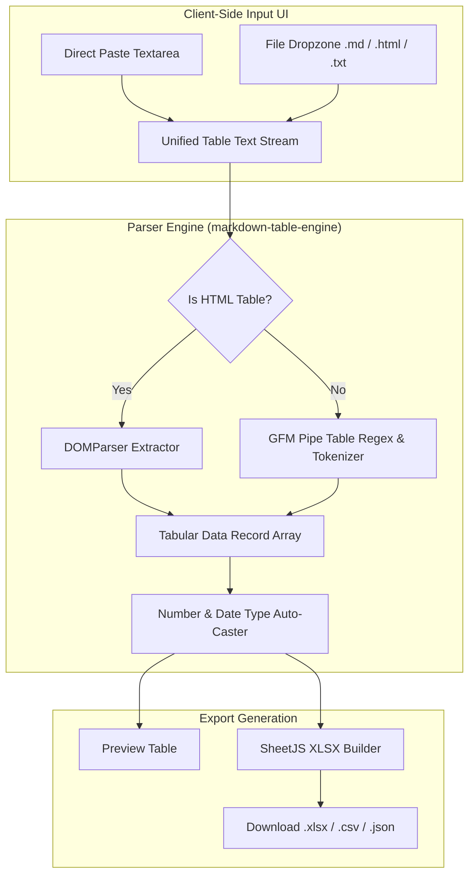

# Markdown & HTML Table to Excel Converter Implementation Plan

> **For agentic workers:** REQUIRED SUB-SKILL: Use superpowers:subagent-driven-development to implement this plan task-by-task. Steps use checkbox (`- [ ]`) syntax for tracking.

**Goal:** Build a 100% client-side Markdown and HTML Table to Excel (`.xlsx`) converter with a split dual-input UI (paste textarea + file dropzone) to capture AI and developer table conversion traffic.

**Architecture:** A pure client-side parser engine (`markdown-table-engine.ts`) extracts tabular rows and headers from GFM pipe tables and HTML `<table>` elements, generating auto-styled `.xlsx` workbooks via SheetJS. The frontend features a responsive Split Input component supporting instant clipboard paste, sample table loading, and standard file drag-and-drop.

**Architecture Diagram:**



**Tech Stack:** TypeScript, Next.js 14 App Router, SheetJS (`xlsx`), Lucide React, Vitest, Playwright.

---

### Task 1: Parser Engine & Types (`markdown-table-engine.ts`)

**Files:**
- Create: `frontend/src/lib/engines/markdown-table-engine.ts`
- Create: `frontend/src/lib/engines/__tests__/markdown-table-engine.test.ts`
- Modify: `frontend/src/types/converter.ts`
- Modify: `frontend/src/lib/engines/index.ts`

- [ ] **Step 1: Update `ConverterEngineId` type**
  In `frontend/src/types/converter.ts`:
  Add `"markdown-to-excel"` to `ConverterEngineId`.

- [ ] **Step 2: Write failing unit test for `markdownTableEngine`**
  In `frontend/src/lib/engines/__tests__/markdown-table-engine.test.ts`:
  - Test parsing GFM pipe table with alignments: `| Name | Age | Revenue |`.
  - Test parsing HTML table `<table><tr><th>Product</th><th>Price</th></tr>...</table>`.
  - Test numeric casting (`$1,250.50` -> `1250.5`).
  - Test conversion to Excel binary buffer.

- [ ] **Step 3: Run test to verify failure**
  Run: `npm test src/lib/engines/__tests__/markdown-table-engine.test.ts`
  Expected: FAIL with module not found.

- [ ] **Step 4: Implement `markdownTableEngine`**
  In `frontend/src/lib/engines/markdown-table-engine.ts`:
  - Implement `IConverterEngine`.
  - `parseMarkdownTable(text: string): TabularData`
  - `parseHtmlTable(text: string): TabularData`
  - `parsePreview(file: File)`: reads text, detects HTML vs Markdown, returns preview rows.
  - `convert(file: File, options?: ConversionOptions)`: builds SheetJS workbook with auto column width formatting.

- [ ] **Step 5: Register engine in `src/lib/engines/index.ts`**
  Export `markdownTableEngine` and add to `ENGINES` map.

- [ ] **Step 6: Run test to verify pass**
  Run: `npm test src/lib/engines/__tests__/markdown-table-engine.test.ts`
  Expected: PASS.

- [ ] **Step 7: Commit**
  ```bash
  git add frontend/src/types/converter.ts frontend/src/lib/engines/
  git commit -m "feat(engine): add markdown and html table to excel parsing engine"
  ```

---

### Task 2: Registry, SEO & Programmatic Routing

**Files:**
- Modify: `frontend/src/lib/registry.ts`
- Test: `frontend/src/lib/__tests__/registry.test.ts`

- [ ] **Step 1: Write test for `"markdown-to-excel"` registry config**
  Verify `getConverterBySlug("markdown-to-excel")` returns valid config with accepted extensions `.md`, `.markdown`, `.html`.

- [ ] **Step 2: Add `"markdown-to-excel"` to `CONVERTER_REGISTRY`**
  Add full SEO metadata, `howTo` 3-step guide, and targeted FAQs (e.g. *"Can I convert tables generated by ChatGPT or Claude?"*, *"Does it support HTML tables with formatting?"*).

- [ ] **Step 3: Run registry tests**
  Run: `npm test src/lib/__tests__/registry.test.ts`
  Expected: PASS.

- [ ] **Step 4: Commit**
  ```bash
  git add frontend/src/lib/registry.ts frontend/src/lib/__tests__/registry.test.ts
  git commit -m "feat(registry): register markdown-to-excel converter configuration"
  ```

---

### Task 3: Split Input Component (Paste Textarea + File Dropzone)

**Files:**
- Create: `frontend/src/components/converter/SplitTableInput.tsx`
- Modify: `frontend/src/components/converter/ConverterCard.tsx`

- [ ] **Step 1: Create `SplitTableInput.tsx`**
  - Left panel: Multi-line textarea for pasting Markdown or HTML tables.
  - Buttons: "Paste from Clipboard", "Load Sample Markdown Table", "Clear".
  - Right panel: File dropzone for `.md`, `.markdown`, `.html`, `.txt`.
  - On paste or text edit: creates a virtual `File` object (`new File([text], "pasted-table.md", { type: "text/markdown" })`) and triggers `onFileSelect`.

- [ ] **Step 2: Integrate `SplitTableInput` into `ConverterCard.tsx`**
  When `config.slug === "markdown-to-excel"` and no file is selected yet, render `SplitTableInput` instead of standard solitary dropzone.

- [ ] **Step 3: Run unit tests**
  Run: `npm test`
  Expected: PASS.

- [ ] **Step 4: Commit**
  ```bash
  git add frontend/src/components/converter/
  git commit -m "feat(ui): add split textarea and dropzone input for markdown converter"
  ```

---

### Task 4: E2E Verification & Integration Tests

**Files:**
- Create: `frontend/e2e/markdown-converter.spec.ts`
- Modify: `frontend/src/app/sitemap.ts`

- [ ] **Step 1: Add Playwright E2E test for Markdown converter**
  - Verify `/convert/markdown-to-excel` returns HTTP 200 with proper heading & canonical.
  - Test pasting markdown table into textarea and verifying table preview table renders.
  - Test `/embed/markdown-to-excel` loads cleanly in iframe mode without navbar.

- [ ] **Step 2: Run Playwright tests**
  Run: `npm run test:e2e`
  Expected: PASS across desktop and mobile.

- [ ] **Step 3: Run full build and test suite**
  Run: `npm test && npm run build`
  Expected: All 420+ tests pass, static pages compile cleanly.

- [ ] **Step 4: Commit & Push**
  ```bash
  git add . && git commit -m "feat: complete markdown and html table to excel converter" && git push origin main
  ```
