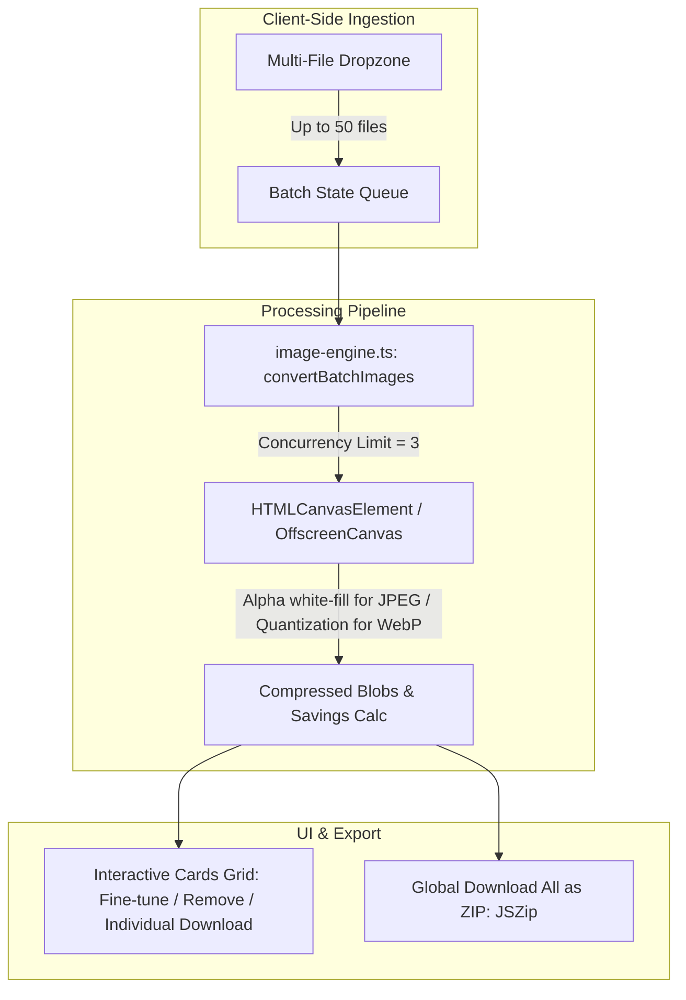

# Bulk Image Compressor Suite Implementation Plan

> **For agentic workers:** REQUIRED SUB-SKILL: Use superpowers:subagent-driven-development to implement this plan task-by-task. Steps use checkbox (`- [ ]`) syntax for tracking.

**Goal:** Build a high-performance, 100% in-browser Bulk Image Compressor & Optimizer supporting multi-image upload, per-card fine-tuning, global compression sliders, client-side ZIP bundling, and programmatic SEO routes.

**Architecture:** Extend `image-engine.ts` with a concurrent batch processing queue and clean RGBA white-fill for lossy formats. Build `BulkImageCompressor.tsx` leveraging `useFileDropAndPaste`, individual card controls, and `createZipArchive` from `zip-utils.ts`. Register `/tools/compress-image` and presets (`compress-jpeg`, `compress-png`, `compress-webp`) in `TOOL_REGISTRY` and wire into `tools/[slug]/page.tsx`.

**Architecture Diagram:**

**Tech Stack:** Next.js 14 App Router, TypeScript, React 18, Tailwind CSS, Lucide React, JSZip, HTML5 Canvas API, Vitest.

---

### Task 1: Extend Image Engine for Batch Processing & Format Options

**Files:**
- Modify: `frontend/src/lib/engines/image-engine.ts`
- Test: `frontend/src/lib/engines/__tests__/image-engine.test.ts`

- [ ] **Step 1: Write unit tests for batch compression, format handling, and background filling**
  Add tests in `image-engine.test.ts` verifying:
  - `convertImage` fills transparent alpha channel with white background when format is `image/jpeg`.
  - `convertBatchImages` handles multiple `File` inputs with concurrency and returns results for each file.
  - Generates calculated percentage savings accurately.

- [ ] **Step 2: Run test to verify it fails**
  Run: `npm test src/lib/engines/__tests__/image-engine.test.ts`

- [ ] **Step 3: Implement batch processing & background color support in `image-engine.ts`**
  - Add `backgroundColor?: string` to `ImageConversionOptions`.
  - Fill rect with `options.backgroundColor || "#ffffff"` if `format === "image/jpeg"`.
  - Export `convertBatchImages(files: File[], options: ImageConversionOptions, concurrency?: number)`.

- [ ] **Step 4: Run test to verify it passes**
  Run: `npm test src/lib/engines/__tests__/image-engine.test.ts`

- [ ] **Step 5: Commit**
  Run: `git add frontend/src/lib/engines/ && git commit -m "feat(engine): add batch processing and background fill to image-engine"`

---

### Task 2: Build Interactive `BulkImageCompressor` UI Component

**Files:**
- Create: `frontend/src/components/tools/BulkImageCompressor.tsx`
- Test: `frontend/src/components/tools/__tests__/BulkImageCompressor.test.tsx`

- [ ] **Step 1: Write component tests for `BulkImageCompressor`**
  Add tests verifying:
  - Renders multi-file upload dropzone.
  - Updates all items when global quality slider changes.
  - Can remove single item from the batch list.
  - Triggers individual file download and "Download All (ZIP)".

- [ ] **Step 2: Run test to verify it fails**
  Run: `npm test src/components/tools/__tests__/BulkImageCompressor.test.tsx`

- [ ] **Step 3: Implement `BulkImageCompressor.tsx`**
  - Multi-file dropzone with drag-and-drop (`useFileDropAndPaste`).
  - Global control bar (Quality slider 1-100%, Max Resolution selector, Format selector: Original / WebP / JPEG / PNG).
  - Summary stats bar (Total files, Original total size, Compressed total size, % Saved).
  - Responsive image card grid with thumbnail, before/after badges, individual quality slider override, remove button, single download.
  - "Download All (ZIP)" button hooked to `createZipArchive` and `downloadBlob`.

- [ ] **Step 4: Run test to verify it passes**
  Run: `npm test src/components/tools/__tests__/BulkImageCompressor.test.tsx`

- [ ] **Step 5: Commit**
  Run: `git add frontend/src/components/tools/ && git commit -m "feat(ui): implement BulkImageCompressor component with per-card controls and ZIP export"`

---

### Task 3: Tool Registry Configuration & SEO Slugs

**Files:**
- Modify: `frontend/src/lib/image-tools-data.ts`
- Modify: `frontend/src/lib/tool-registry.ts`
- Test: `frontend/src/lib/__tests__/tool-registry.test.ts`

- [ ] **Step 1: Write tests for `compress-image`, `compress-jpeg`, `compress-png`, and `compress-webp`**
  Verify all 4 slugs exist in `TOOL_REGISTRY`, have valid metadata, `howTo`, and `faqs`.

- [ ] **Step 2: Run test to verify it fails**
  Run: `npm test src/lib/__tests__/tool-registry.test.ts`

- [ ] **Step 3: Register tools in `image-tools-data.ts`**
  - Add `compress-image` (Main bulk tool).
  - Add `compress-jpeg` (Targeted JPG / JPEG SEO preset).
  - Add `compress-png` (Targeted PNG lossless & lossy preset).
  - Add `compress-webp` (Targeted WebP preset).
  - Update `image-compressor` to alias/point to `compress-image`.

- [ ] **Step 4: Run test to verify it passes**
  Run: `npm test src/lib/__tests__/tool-registry.test.ts`

- [ ] **Step 5: Commit**
  Run: `git add frontend/src/lib/ && git commit -m "feat(registry): register compress-image and format presets in tool registry"`

---

### Task 4: Connect Routing in `src/app/tools/[slug]/page.tsx` & Verify Build

**Files:**
- Modify: `frontend/src/app/tools/[slug]/page.tsx`
- Test: `frontend/src/app/tools/[slug]/__tests__/page.test.tsx`

- [ ] **Step 1: Wire `BulkImageCompressor` to tool router**
  - In `src/app/tools/[slug]/page.tsx`: Map `compress-image`, `compress-jpeg`, `compress-png`, and `compress-webp` (and `image-compressor`) to render `BulkImageCompressor` with initial preset format.

- [ ] **Step 2: Run test suites**
  Run: `npm test` (Verify all 61+ test suites pass).

- [ ] **Step 3: Run Next.js static build & link audit**
  Run: `npm run build` and `node scripts/audit-pages.js`.

- [ ] **Step 4: Commit and push**
  Run: `git add -A && git commit -m "feat(tools): route bulk image compressor across SEO presets" && git push origin main`
