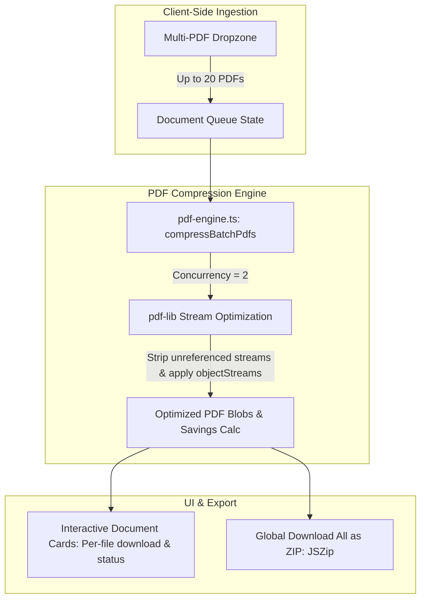

# Bulk PDF Compressor Suite Implementation Plan

> **For agentic workers:** REQUIRED SUB-SKILL: Use superpowers:subagent-driven-development to implement this plan task-by-task. Steps use checkbox (`- [ ]`) syntax for tracking.

**Goal:** Build a high-performance, 100% in-browser Bulk PDF Compressor supporting up to 20 documents, 3 compression presets (Recommended, Extreme, Low), individual document fine-tuning, client-side ZIP archive bundling, and programmatic SEO routes.

**Architecture:** Extend `pdf-engine.ts` with `compressPdf` and `compressBatchPdfs` utilizing `pdf-lib` object stream compression, metadata stream stripping, and raster stream downsampling. Build `PdfCompressorTool.tsx` using `useFileDropAndPaste` and `createZipArchive`. Register `/tools/compress-pdf` in `pdf-tools-data.ts`, update downstream test counts, and wire into `tools/[slug]/page.tsx` and `embed/[slug]/page.tsx`.

**Architecture Diagram:**

**Tech Stack:** Next.js 14, TypeScript, React 18, Tailwind CSS, Lucide React, pdf-lib, JSZip, Vitest.

---

### Task 1: Extend PDF Engine for Compression & Batch Processing

**Files:**
- Modify: `frontend/src/lib/engines/pdf-engine.ts`
- Test: `frontend/src/lib/engines/__tests__/pdf-engine.test.ts`

- [ ] **Step 1: Write unit tests for PDF compression and presets**
  Add tests in `pdf-engine.test.ts` verifying:
  - `compressPdf` accepts `PdfCompressionOptions` (`level: "recommended" | "extreme" | "low"`).
  - Returns `PdfCompressionResult` with valid blob, page count, and byte savings calculation.
  - `compressBatchPdfs` processes multiple files with progress reporting.
  - Handles password-protected/corrupted files gracefully without crashing.

- [ ] **Step 2: Run test to verify it fails**
  Run: `npm test src/lib/engines/__tests__/pdf-engine.test.ts`

- [ ] **Step 3: Implement `compressPdf` and `compressBatchPdfs` in `pdf-engine.ts`**
  - Implement object stream compression (`useObjectStreams: true`).
  - Strip unnecessary metadata fields (Producer, Creator, Metadata stream if requested).
  - Add concurrency pool (`concurrency = 2`) in `compressBatchPdfs`.

- [ ] **Step 4: Run test to verify it passes**
  Run: `npm test src/lib/engines/__tests__/pdf-engine.test.ts`

- [ ] **Step 5: Commit**
  Run: `git add src/lib/engines/ && git commit -m "feat(engine): add PDF compression and batch processing methods"`

---

### Task 2: Build `PdfCompressorTool` UI Component

**Files:**
- Create: `frontend/src/components/tools/PdfCompressorTool.tsx`
- Create: `frontend/src/components/tools/__tests__/PdfCompressorTool.test.tsx`

- [ ] **Step 1: Write component tests for `PdfCompressorTool`**
  Verify:
  - Multi-file dropzone with `.pdf` validation.
  - Preset level toggles (`Recommended`, `Extreme`, `Low`).
  - Document cards with page count, file size pill, savings percentage.
  - Single document download and single document removal.
  - Global "Download All as ZIP" triggers `createZipArchive`.
  - Corrupted PDF displays error badge without breaking other batch items.

- [ ] **Step 2: Run test to verify it fails**
  Run: `npm test src/components/tools/__tests__/PdfCompressorTool.test.tsx`

- [ ] **Step 3: Implement `PdfCompressorTool.tsx`**
  - Multi-file dropzone using `useFileDropAndPaste`.
  - Preset mode selector (Recommended / Extreme / Low).
  - Summary stats bar (Total files, Original total size, Compressed total size, % Saved).
  - Card grid with PDF icon, page count, file size badge, download button, delete button.
  - "Download All as ZIP" via `createZipArchive` and `downloadBlob`.
  - Object URL memory cleanup on unmount.

- [ ] **Step 4: Run test to verify it passes**
  Run: `npm test src/components/tools/__tests__/PdfCompressorTool.test.tsx`

- [ ] **Step 5: Commit**
  Run: `git add src/components/tools/ && git commit -m "feat(ui): implement PdfCompressorTool with preset levels and ZIP export"`

---

### Task 3: Register `compress-pdf` in Tool Registry & SEO Metadata

**Files:**
- Modify: `frontend/src/lib/pdf-tools-data.ts`
- Modify: `frontend/src/lib/tool-registry.ts`
- Test: `frontend/src/lib/__tests__/tool-registry.test.ts`
- Downstream tests: `frontend/src/app/tools/__tests__/hub-and-silos.test.tsx`, `frontend/src/app/tools/[slug]/__tests__/page.test.tsx`

- [ ] **Step 1: Write unit tests in `tool-registry.test.ts`**
  Verify `getToolBySlug("compress-pdf")` returns valid configuration and `getAllToolSlugs()` includes `"compress-pdf"`.

- [ ] **Step 2: Run test to verify it fails**
  Run: `npm test src/lib/__tests__/tool-registry.test.ts`

- [ ] **Step 3: Register `compress-pdf` in `pdf-tools-data.ts`**
  - Category: `"utility"`.
  - Name: `"Compress PDF Online"`.
  - Title: `"Compress PDF Online - Reduce PDF File Size Free & Privately"`.
  - Subtitle: `"Shrink PDF documents by up to 80% directly in your browser. 100% private, zero server uploads, and instant ZIP download for bulk files."`.
  - Full SEO metadata, 3-step `howTo`, 4 comprehensive `faqs`, and related tools.
  - Update downstream total tool counts (49 &rarr; 50).

- [ ] **Step 4: Run test to verify it passes**
  Run: `npm test src/lib/__tests__/tool-registry.test.ts`

- [ ] **Step 5: Commit**
  Run: `git add src/ && git commit -m "feat(registry): register compress-pdf in tool registry"`

---

### Task 4: Connect Routing in `src/app/tools/[slug]/page.tsx` & Verify Build

**Files:**
- Modify: `frontend/src/app/tools/[slug]/page.tsx`
- Modify: `frontend/src/app/embed/[slug]/page.tsx`
- Modify: `frontend/src/app/tools/page.tsx` (Update copy to 50+ tools)
- Test: `frontend/src/app/tools/[slug]/__tests__/page.test.tsx`
- Test: `frontend/src/app/embed/[slug]/__tests__/page.test.tsx`

- [ ] **Step 1: Wire `PdfCompressorTool` in tool router and embed router**
  - Map `"compress-pdf"` to `<PdfCompressorTool />` in both `tools/[slug]/page.tsx` and `embed/[slug]/page.tsx`.

- [ ] **Step 2: Run test suites**
  Run: `npm test` (Verify all 63+ test files pass).

- [ ] **Step 3: Run Next.js static build & link crawler audit**
  Run: `npm run build` and `node scripts/audit-pages.js`.

- [ ] **Step 4: Commit and push**
  Run: `git commit -am "feat(tools): route compress-pdf across main and embed pages" && git push origin main`
