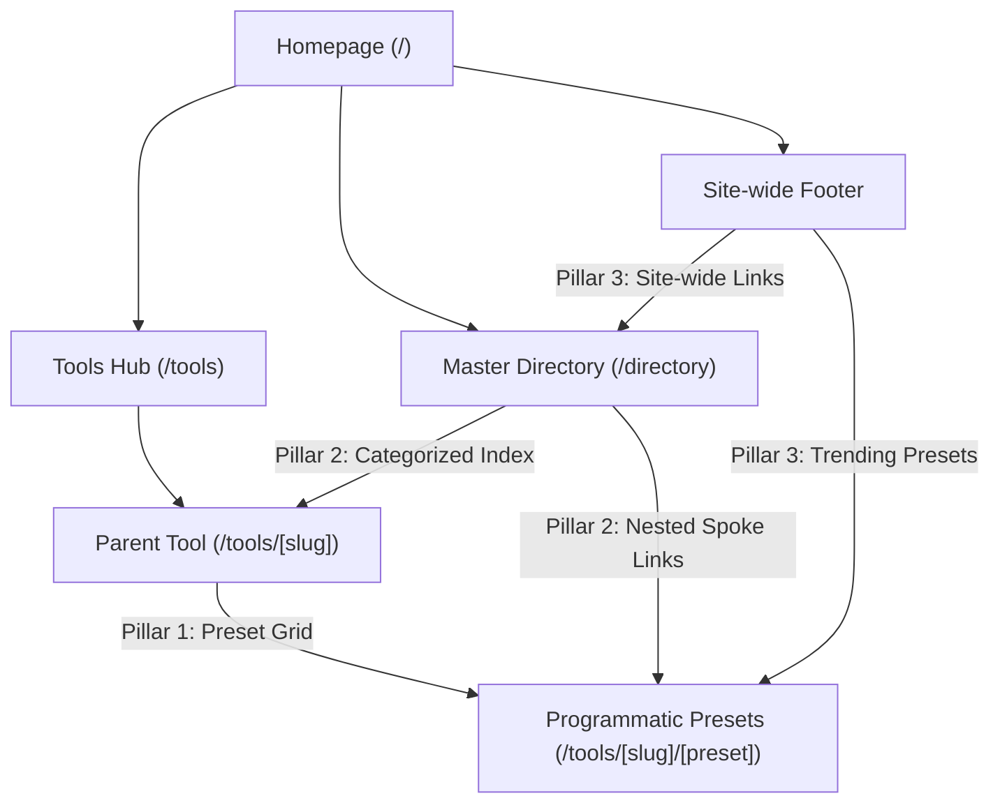

# Internal Linking & Link Equity Implementation Plan

> **For agentic workers:** REQUIRED SUB-SKILL: Use superpowers:subagent-driven-development to implement this plan task-by-task. Steps use checkbox (`- [ ]`) syntax for tracking.

**Goal:** Establish an interconnected internal linking architecture (Parent Tool Preset Grids, Semantic HTML `/directory`, and Footer Trending Links) to eliminate orphaned pages, distribute PageRank, and reduce crawl depth to $\le 3$ clicks for all 124 programmatic SEO presets.

**Architecture:** 
1. `src/app/tools/[slug]/page.tsx` renders a dedicated "Popular Scenarios & Calculations" card grid for any tool with registered programmatic presets, passing anchor equity directly from parent tools to child presets.
2. `src/app/directory/page.tsx` provides a pure static SSG Master Directory and HTML sitemap with semantic taxonomy, categorized anchor jumps, and Schema.org `CollectionPage` structured data.
3. `src/components/layout/Footer.tsx` integrates top GSC trending calculation links and a site-wide link to `/directory`.

**Architecture Diagram:**

---

## Tasks

### Task 1: Parent Tool Preset Grid (`src/app/tools/[slug]/page.tsx`)
**Files:**
- Modify: `frontend/src/app/tools/[slug]/page.tsx`
- Modify: `frontend/src/app/tools/[slug]/__tests__/page.test.tsx`

- [ ] Step 1.1: Write failing test in `src/app/tools/[slug]/__tests__/page.test.tsx` asserting that for a tool with presets (e.g., `percentage-calculator` or `mortgage-calculator`), the page renders the "Popular Scenarios & Calculations" section with links to its child presets.
- [ ] Step 1.2: Run test with `npm test src/app/tools/[slug]/__tests__/page.test.tsx` and confirm failure.
- [ ] Step 1.3: In `frontend/src/app/tools/[slug]/page.tsx`, import `getProgrammaticPresetsByTool` from `@/lib/programmatic-presets`.
- [ ] Step 1.4: Retrieve presets for current tool: `const toolPresets = getProgrammaticPresetsByTool(tool.slug);`.
- [ ] Step 1.5: If `toolPresets.length > 0`, render the preset grid section below the calculator card and above How-To guide. Group large preset lists cleanly so page remains visually balanced.
- [ ] Step 1.6: Run `npm test src/app/tools/[slug]/__tests__/page.test.tsx` and confirm passes.
- [ ] Step 1.7: Commit changes with message `feat(seo): add parent tool preset grid for internal link equity`.

---

### Task 2: Semantic HTML Directory (`src/app/directory/page.tsx`)
**Files:**
- Create: `frontend/src/app/directory/page.tsx`
- Create: `frontend/src/app/directory/__tests__/page.test.tsx`
- Modify: `frontend/src/app/sitemap.ts`
- Modify: `frontend/src/app/convert/[slug]/__tests__/page.test.tsx`

- [ ] Step 2.1: Write test suite in `frontend/src/app/directory/__tests__/page.test.tsx` testing metadata, breadcrumbs, JSON-LD Schema (`CollectionPage`), categorized anchor links, and rendering of all tools and converters.
- [ ] Step 2.2: Run test to confirm it fails (module not found).
- [ ] Step 2.3: Implement `frontend/src/app/directory/page.tsx`:
  - Static Server Component with export metadata (`title`, `description`, `canonical: "https://www.convertsheet.com/directory"`).
  - Breadcrumb navigation (`Home > Complete Directory`).
  - Anchor jump navigation pills (`#financial-calculators`, `#data-developer`, `#document-pdf`, `#converters`).
  - Hierarchical listing of all 51 tools, 21 converters, and 124 programmatic presets grouped by parent category.
  - Valid Schema.org `CollectionPage` and `BreadcrumbList`.
- [ ] Step 2.4: In `frontend/src/app/sitemap.ts`, add `/directory` entry with priority 0.8.
- [ ] Step 2.5: In `frontend/src/app/convert/[slug]/__tests__/page.test.tsx`, update expected sitemap entries count from 214 to 215.
- [ ] Step 2.6: Run tests `npm test "src/app/directory/__tests__/page.test.tsx"` and `npm test "src/app/convert/[slug]/__tests__/page.test.tsx"` to verify pass.
- [ ] Step 2.7: Commit changes with message `feat(seo): create semantic HTML master directory and sitemap at /directory`.

---

### Task 3: Footer Trending Calculations & Directory Link (`Footer.tsx`)
**Files:**
- Modify: `frontend/src/components/layout/Footer.tsx`
- Modify: `frontend/src/components/layout/__tests__/layout.test.tsx`

- [ ] Step 3.1: In `frontend/src/components/layout/__tests__/layout.test.tsx`, add assertions for trending calculation links and directory link.
- [ ] Step 3.2: Run test to verify failure.
- [ ] Step 3.3: In `frontend/src/components/layout/Footer.tsx`, add a curated list of top GSC trending calculations (`15 vs 30 Year Mortgage`, `What is 20% of 100?`, `$100k Salary After Tax`, `20% Off Discount Calculator`, etc.) and add link to `/directory` ("Complete Tools Directory").
- [ ] Step 3.4: Run `npm test "src/components/layout/__tests__/layout.test.tsx"` to verify pass.
- [ ] Step 3.5: Commit changes with message `feat(seo): add trending calculation links and master directory bridge in footer`.

---

### Task 4: End-to-End Verification & GSC Resubmission
**Files:**
- All touched files

- [ ] Step 4.1: Run full test suite: `npm test` (all 71+ suites must pass).
- [ ] Step 4.2: Run static export build: `npm run build` (all static pages must generate cleanly).
- [ ] Step 4.3: Run full site accessibility & link audit: `npm run audit` (must pass with 0 errors, 0 warnings).
- [ ] Step 4.4: Push commit to `origin/main`.
- [ ] Step 4.5: Resubmit `https://www.convertsheet.com/sitemap.xml` via Google Search Console tool.
