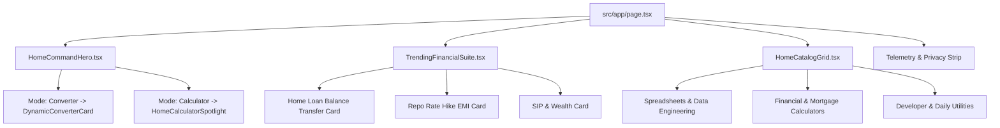

# ConvertSheet Homepage Redesign Implementation Plan

> **For agentic workers:** REQUIRED SUB-SKILL: Use superpowers:subagent-driven-development to implement this plan task-by-task. Steps use checkbox (`- [ ]`) syntax for tracking.

**Goal:** Redesign the ConvertSheet homepage from scratch with an interactive Dual-Mode Command Hero (Universal File Converter vs Financial & Dev Calculators), quick command search, trending financial suite, and unified tools catalog.

**Architecture:** Build modular client and server components under `src/components/home/`: `HomeCommandHero` handles zero-reload mode switching with instant format pills and active workbench spotlight, `TrendingFinancialSuite` spotlights high-demand loan and wealth calculators, and `HomeCatalogGrid` provides categorized discovery across all 45 converters and 57 tools.

**Architecture Diagram:**

**Tech Stack:** Next.js 14 App Router, TypeScript, Tailwind CSS, Lucide React, Vitest, React Testing Library.

---

### Task 1: Create HomeCalculatorSpotlight Component

**Files:**
- Create: `src/components/home/HomeCalculatorSpotlight.tsx`
- Test: `src/components/home/__tests__/HomeCalculatorSpotlight.test.tsx`

- [ ] **Step 1: Write the failing test**
Create test in `src/components/home/__tests__/HomeCalculatorSpotlight.test.tsx` testing tab switching between "Home Loan Balance Transfer", "Interest Rate Hike", and "EMI Calculator".

- [ ] **Step 2: Run test to verify it fails**
Run: `npx vitest run src/components/home/__tests__/HomeCalculatorSpotlight.test.tsx`
Expected: FAIL (module not found).

- [ ] **Step 3: Implement minimal HomeCalculatorSpotlight component**
Build `HomeCalculatorSpotlight.tsx` with clean tabs switching between `BalanceTransferCalculator`, `RateHikeCalculator`, and `EmiCalculator`.

- [ ] **Step 4: Run tests to verify they pass**
Run: `npx vitest run src/components/home/__tests__/HomeCalculatorSpotlight.test.tsx`
Expected: PASS.

- [ ] **Step 5: Commit**
`git add src/components/home/HomeCalculatorSpotlight.tsx src/components/home/__tests__/HomeCalculatorSpotlight.test.tsx`
`git commit -m "feat(home): add HomeCalculatorSpotlight component"`

---

### Task 2: Create HomeCommandHero Component

**Files:**
- Create: `src/components/home/HomeCommandHero.tsx`
- Test: `src/components/home/__tests__/HomeCommandHero.test.tsx`

- [ ] **Step 1: Write the failing test**
Create test in `src/components/home/__tests__/HomeCommandHero.test.tsx` verifying:
- Mode toggle between "📁 Universal File Converter" and "⚡ Financial & Dev Calculators".
- Format pills render and trigger converter switches.
- Renders `DynamicConverterCard` when mode is converter, and `HomeCalculatorSpotlight` when mode is calculator.

- [ ] **Step 2: Run test to verify it fails**
Run: `npx vitest run src/components/home/__tests__/HomeCommandHero.test.tsx`
Expected: FAIL.

- [ ] **Step 3: Implement HomeCommandHero**
Build `HomeCommandHero.tsx` with floating segmented mode pills, quick format shortcuts (JSON to Excel, CSV to Excel, Parquet to CSV, XML to Excel), and instant switching.

- [ ] **Step 4: Run tests to verify they pass**
Run: `npx vitest run src/components/home/__tests__/HomeCommandHero.test.tsx`
Expected: PASS.

- [ ] **Step 5: Commit**
`git add src/components/home/HomeCommandHero.tsx src/components/home/__tests__/HomeCommandHero.test.tsx`
`git commit -m "feat(home): add HomeCommandHero dual-mode switcher component"`

---

### Task 3: Create TrendingFinancialSuite Component

**Files:**
- Create: `src/components/home/TrendingFinancialSuite.tsx`
- Test: `src/components/home/__tests__/TrendingFinancialSuite.test.tsx`

- [ ] **Step 1: Write the failing test**
Create test in `src/components/home/__tests__/TrendingFinancialSuite.test.tsx` verifying feature cards for Balance Transfer, Rate Hike, and EMI with direct links and badges.

- [ ] **Step 2: Run test to verify it fails**
Run: `npx vitest run src/components/home/__tests__/TrendingFinancialSuite.test.tsx`
Expected: FAIL.

- [ ] **Step 3: Implement TrendingFinancialSuite**
Build `TrendingFinancialSuite.tsx` presenting interactive summary cards, live calculation formulas, and 1-click links to `/tools/home-loan-balance-transfer-calculator` and `/tools/interest-rate-hike-calculator`.

- [ ] **Step 4: Run tests to verify they pass**
Run: `npx vitest run src/components/home/__tests__/TrendingFinancialSuite.test.tsx`
Expected: PASS.

- [ ] **Step 5: Commit**
`git add src/components/home/TrendingFinancialSuite.tsx src/components/home/__tests__/TrendingFinancialSuite.test.tsx`
`git commit -m "feat(home): add TrendingFinancialSuite showcase component"`

---

### Task 4: Integrate Redesigned Homepage in `src/app/page.tsx`

**Files:**
- Modify: `src/app/page.tsx`
- Test: `src/app/__tests__/pages.test.tsx`

- [ ] **Step 1: Update homepage integration tests**
Update `src/app/__tests__/pages.test.tsx` to assert new Dual Hero Command Center, mode switcher, and trending financial cards.

- [ ] **Step 2: Run test to observe failure**
Run: `npx vitest run src/app/__tests__/pages.test.tsx`
Expected: FAIL.

- [ ] **Step 3: Update `src/app/page.tsx`**
Refactor `src/app/page.tsx` to integrate `HomeCommandHero`, `TrendingFinancialSuite`, and updated metrics.

- [ ] **Step 4: Run tests to verify they pass**
Run: `npx vitest run src/app/__tests__/pages.test.tsx`
Expected: PASS.

- [ ] **Step 5: Commit**
`git add src/app/page.tsx src/app/__tests__/pages.test.tsx`
`git commit -m "feat(home): integrate command center dual hero and trending finance suite into homepage"`

---

### Task 5: End-to-End Verification & Build Check

**Files:**
- Run: `npm run lint`
- Run: `npm test`
- Run: `npm run build`

- [ ] **Step 1: Run linter**
Verify 0 errors and warnings.

- [ ] **Step 2: Run full test suite**
Verify all 79+ test files pass.

- [ ] **Step 3: Run production build**
Verify all 1,936 static pages compile cleanly.

- [ ] **Step 4: Commit and push**
`git push origin main`
