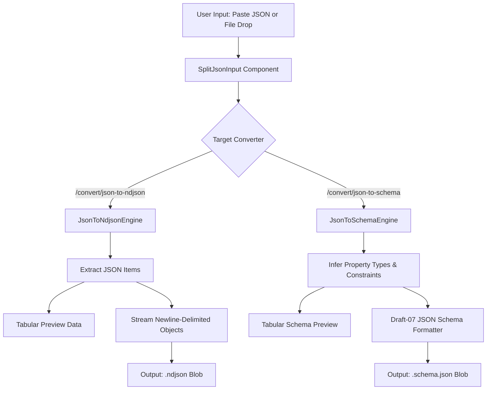

# JSON to NDJSON & JSON Schema Generator Design Spec

**Date:** 2026-09-18  
**Topic:** JSON to NDJSON & JSON Schema Generator  
**Status:** Approved by User  

---

## 1. Problem & Objectives
Developers and AI practitioners frequently need to transform standard JSON (arrays of objects or nested API responses) into:
1. **Newline-Delimited JSON (`.ndjson` / `.jsonl`)**: Required by vector database bulk ingestion (Pinecone, Weaviate, Qdrant), Elasticsearch/OpenSearch bulk indices, and OpenAI/Anthropic finetuning datasets.
2. **JSON Schema (Draft-07 / 2020-12)**: Required for API contracts, OpenAPI specs, structured LLM function-calling definitions, and payload validation.

Currently, developers have to write ad-hoc Python/Node scripts or upload sensitive internal JSON payloads to unverified online tools. ConvertSheet will provide 100% in-browser, private conversion with dual paste/dropzone inputs and instant tabular previews.

---

## 2. System Architecture



---

## 3. Detailed Specifications

### A. Engine Implementations (`src/lib/engines/ndjson-schema-engine.ts`)
1. **`JsonToNdjsonEngine` (`id: "json-to-ndjson"`):**
   - Implements `IConverterEngine`.
   - Accepts `.json` files or text buffers.
   - `parsePreview`: Uses `extractJsonItems` to extract up to `maxRows` (default 10) records, returning `TabularData` with detected columns, records, and `totalRows`.
   - `convert`: Serializes each record with `JSON.stringify(item)` separated by `\n`. Supports `options.flattenNested` to flatten nested paths with dot notation. Returns `ConversionOutput` with MIME `application/x-ndjson` and filename `<basename>.ndjson`.

2. **`JsonToSchemaEngine` (`id: "json-to-schema"`):**
   - Implements `IConverterEngine`.
   - `parsePreview`: Traverses parsed sample records, accumulating properties, inferred types (`string`, `number`, `integer`, `boolean`, `array`, `object`, `null`), nullability, and sample values. Returns `TabularData` where columns are `["Property", "Type", "Required", "Sample Value"]`.
   - `convert`: Generates a standard JSON Schema Draft-07 document:
     ```json
     {
       "$schema": "http://json-schema.org/draft-07/schema#",
       "title": "<basename>",
       "type": "object",
       "properties": { ... },
       "required": [ ... ]
     }
     ```
     Returns `ConversionOutput` with MIME `application/schema+json` and filename `<basename>.schema.json`.

### B. User Experience & Split Input (`SplitJsonInput.tsx`)
- Reusable component for JSON-based developer converters.
- Dual panel interface:
  - **Left Pane:** Textarea for pasting raw JSON with syntax highlighting container, character count, sample JSON loader (`users.json`), and instant JSON syntax error indicator.
  - **Right Pane:** Drag-and-drop zone accepting `.json` and `.txt`.
- Integrated seamlessly into `ConverterCard.tsx` for `json-to-ndjson` and `json-to-schema`.

### C. Programmatic SEO & Routing
- Added to `CONVERTER_REGISTRY` in `src/lib/registry.ts`:
  1. `json-to-ndjson`:
     - Title: `Convert JSON to NDJSON / JSONL Online - Fast & Private`
     - Subtitle: `Transform JSON arrays into Newline-Delimited JSON (NDJSON/JSONL) for vector databases, Elasticsearch, and LLM finetuning locally in your browser.`
     - Extensions: `.json` -> `.ndjson` (additional target `.jsonl`).
     - Category: `data-engineering`.
  2. `json-to-schema`:
     - Title: `Generate JSON Schema from JSON Online - In-Browser Generator`
     - Subtitle: `Infer and generate Draft-07 JSON Schema definitions from sample JSON payloads with zero server uploads.`
     - Extensions: `.json` -> `.schema.json` (additional target `.json`).
     - Category: `data-engineering`.
- Both tools auto-render at `/convert/[slug]` and `/embed/[slug]`.

---

## 4. Verification & Testing
- Unit tests:
  - `ndjson-schema-engine.test.ts`: test array of objects, single object, nested keys, schema inference, draft-07 validity, empty input handling.
  - `SplitJsonInput.test.tsx`: test pasting JSON, sample loader, file dropzone.
  - `registry.test.ts`: verify new slugs and category updates (19 total converters).
- E2E Playwright tests:
  - `e2e/json-ndjson-schema.spec.ts`: test `/convert/json-to-ndjson` and `/convert/json-to-schema` upload, paste, preview, and embed isolation.
