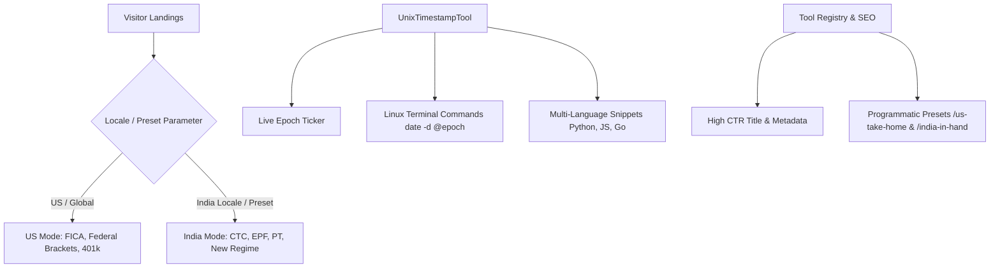

# Ranking Recovery & Regional Calculators Implementation Plan

> **For agentic workers:** REQUIRED SUB-SKILL: Use superpowers:subagent-driven-development to implement this plan task-by-task. Steps use checkbox (`- [ ]`) syntax for tracking.

**Goal:** Overhaul SEO CTR metadata, provide Linux developer bash/CLI timestamp capabilities, build dual-mode US/India salary and income tax engines with dedicated programmatic landing pages, and verify 100% test, audit, and build passes.

**Architecture:**
A unified regional engine architecture allowing `SalaryCalculator` and `IncomeTaxCalculator` to render either US (FICA, Federal, 401k, State, $) or India (CTC, EPF, PT, New Regime Slabs, ₹) seamlessly via currency context auto-detection or explicit UI pill toggles. Enhanced `UnixTimestampTool` integrates live copyable CLI snippets (Linux bash, BSD/macOS, Python, JS). Metadata and programmatic presets expose dedicated regional SEO landing pages.

**Architecture Diagram:**

**Tech Stack:** Next.js 14 (App Router), TypeScript, Tailwind CSS, Lucide Icons, Vitest, React Testing Library.

---

### Task 1: Update Tool Registry Titles & Metadata for High Click-Through (CTR)

**Files:**
- Modify: `src/lib/tool-registry.ts:118-142`
- Test: `src/lib/__tests__/tool-registry.test.ts`

- [ ] **Step 1: Write the failing test**
In `src/lib/__tests__/tool-registry.test.ts`: verify that `unix-timestamp-converter`, `salary-calculator`, and `income-tax-calculator` have the upgraded benefit-driven titles and Linux keywords.

- [ ] **Step 2: Run test to verify it fails**
Run: `npm test src/lib/__tests__/tool-registry.test.ts`
Expected: FAIL due to title/keyword mismatch.

- [ ] **Step 3: Update `src/lib/tool-registry.ts`**
Update `unix-timestamp-converter`, `salary-calculator`, and `income-tax-calculator` with high-CTR titles and expanded FAQs.

- [ ] **Step 4: Run test to verify it passes**
Run: `npm test src/lib/__tests__/tool-registry.test.ts`
Expected: PASS.

- [ ] **Step 5: Commit**
Run: `git commit -am "feat(seo): upgrade title tags and linux timestamp keywords for higher SERP CTR"`

---

### Task 2: Enhance `UnixTimestampTool` with Linux CLI Commands & Intent Matching

**Files:**
- Modify: `src/components/tools/UnixTimestampTool.tsx`
- Test: `src/components/tools/__tests__/data-tools.test.tsx`

- [ ] **Step 1: Write the failing test**
In `src/components/tools/__tests__/data-tools.test.tsx`: assert that the Linux terminal command section renders with `date -d @...` and copyable code blocks.

- [ ] **Step 2: Run test to verify it fails**
Run: `npm test src/components/tools/__tests__/data-tools.test.tsx`
Expected: FAIL with missing Linux CLI elements.

- [ ] **Step 3: Implement Linux Terminal Commands & Cheatsheet in `UnixTimestampTool.tsx`**
Add interactive command generator tabs for Linux Bash (`date -d @1700000000`), macOS (`date -r 1700000000`), Python, and ISO conversion with 1-click copy feedback.

- [ ] **Step 4: Run test to verify it passes**
Run: `npm test src/components/tools/__tests__/data-tools.test.tsx`
Expected: PASS.

- [ ] **Step 5: Commit**
Run: `git commit -am "feat(tools): add linux terminal bash commands and cheatsheet to UnixTimestampTool"`

---

### Task 3: Dual-Mode Regional Salary & Take-Home Engine (US & India)

**Files:**
- Modify: `src/lib/engines/financial-engine.ts`
- Test: `src/lib/engines/__tests__/financial-engine.test.ts`
- Modify: `src/components/tools/SalaryCalculator.tsx`
- Test: `src/components/tools/__tests__/phase2-tools.test.tsx`

- [ ] **Step 1: Write the failing tests for US Salary Engine**
In `src/lib/engines/__tests__/financial-engine.test.ts`: test `calculateUsSalary()` for FICA taxes (6.2% Social Security up to cap, 1.45% Medicare), federal standard deductions ($14,600 Single / $29,200 Married), and federal tax brackets.

- [ ] **Step 2: Run engine test to verify it fails**
Run: `npm test src/lib/engines/__tests__/financial-engine.test.ts`
Expected: FAIL (`calculateUsSalary` not defined).

- [ ] **Step 3: Implement `calculateUsSalary()` in `financial-engine.ts`**
Export `calculateUsSalary()` with complete 2024/2025 federal tax brackets, FICA limits, 401(k) deductions, and state tax estimates.

- [ ] **Step 4: Update `SalaryCalculator.tsx` with Dual-Mode Pill Toggle**
Allow users to switch between `[ 🇺🇸 United States (W-2) ]` and `[ 🇮🇳 India (CTC / In-Hand) ]`, auto-initialized based on `useCurrency().market`.

- [ ] **Step 5: Run tests to verify all pass**
Run: `npm test src/lib/engines/__tests__/financial-engine.test.ts src/components/tools/__tests__/phase2-tools.test.tsx`
Expected: PASS.

- [ ] **Step 6: Commit**
Run: `git commit -am "feat(calculator): add dual-mode US and India take-home pay engine to SalaryCalculator"`

---

### Task 4: Dual-Mode Income Tax Calculator (US Federal & India Slabs)

**Files:**
- Modify: `src/components/tools/IncomeTaxCalculator.tsx`
- Test: `src/components/tools/__tests__/phase2-tools.test.tsx`

- [ ] **Step 1: Write test for US Income Tax Mode**
Add test case in `src/components/tools/__tests__/phase2-tools.test.tsx` verifying US Federal tax calculation with filing status selection.

- [ ] **Step 2: Run test to verify it fails**
Run: `npm test src/components/tools/__tests__/phase2-tools.test.tsx`
Expected: FAIL.

- [ ] **Step 3: Implement US Federal Tax Mode in `IncomeTaxCalculator.tsx`**
Add interactive regime switcher:
- US: Filing status (Single / Married Filing Jointly), standard deduction ($14,600 / $29,200), 7 progressive federal brackets (10%, 12%, 22%, 24%, 32%, 35%, 37%).
- India: Preserves FY 2024-25 New Regime slabs, standard deduction (₹75,000), 87A rebate, and 4% cess.

- [ ] **Step 4: Run test to verify it passes**
Run: `npm test src/components/tools/__tests__/phase2-tools.test.tsx`
Expected: PASS.

- [ ] **Step 5: Commit**
Run: `git commit -am "feat(calculator): add US federal and India slab regimes to IncomeTaxCalculator"`

---

### Task 5: Add Programmatic SEO Presets for Regional Landing Pages

**Files:**
- Modify: `src/lib/programmatic-presets.ts`
- Modify: `src/app/tools/[slug]/[preset]/page.tsx`
- Test: `tests/lib/programmatic-presets.test.ts`
- Test: `src/app/tools/[slug]/[preset]/__tests__/page.test.tsx`

- [ ] **Step 1: Register presets in `programmatic-presets.ts`**
Add:
- `us-take-home-100k` (toolSlug: `salary-calculator`)
- `us-take-home-75k` (toolSlug: `salary-calculator`)
- `india-in-hand-12-lakh` (toolSlug: `salary-calculator`)
- `us-federal-tax-single` (toolSlug: `income-tax-calculator`)
- `india-tax-new-regime` (toolSlug: `income-tax-calculator`)

- [ ] **Step 2: Connect presets in `src/app/tools/[slug]/[preset]/page.tsx`**
Wire `SalaryCalculator` and `IncomeTaxCalculator` to `renderCalculator()` with `initialValues` from preset.

- [ ] **Step 3: Run programmatic preset tests**
Run: `npm test tests/lib/programmatic-presets.test.ts src/app/tools/[slug]/[preset]/__tests__/page.test.tsx`
Expected: PASS.

- [ ] **Step 4: Commit**
Run: `git commit -am "feat(seo): add programmatic presets for US and India salary and tax landing pages"`

---

### Task 6: Final Verification, Audit, Build & Push

**Files:**
- Full codebase

- [ ] **Step 1: Run full test suite**
Run: `npm test`
Expected: All 63+ test suites pass.

- [ ] **Step 2: Run SEO and accessibility audit**
Run: `npm run audit`
Expected: 0 errors, 0 warnings across all pages.

- [ ] **Step 3: Run production build**
Run: `npm run build`
Expected: Clean static page compilation across all routes.

- [ ] **Step 4: Push to origin/main**
Run: `git push origin main`
