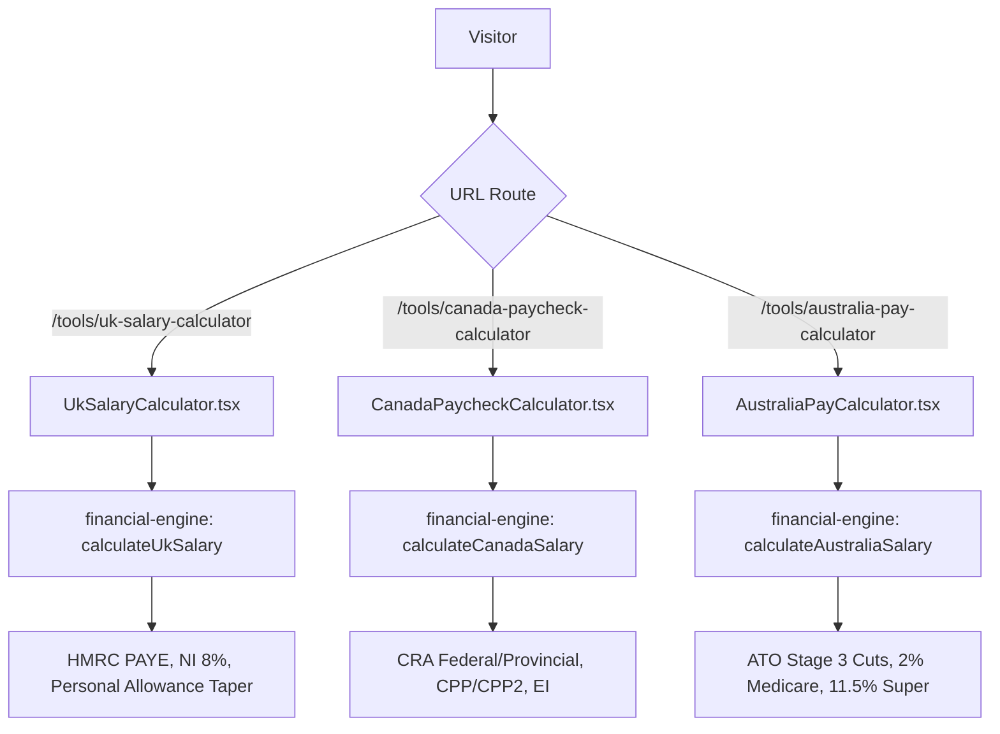

# Global Regional Calculators Implementation Plan (UK, Canada, Australia)

> **For agentic workers:** REQUIRED SUB-SKILL: Use superpowers:subagent-driven-development to implement this plan task-by-task. Steps use checkbox (`- [ ]`) syntax for tracking.

**Goal:** Build and deploy 3 dedicated, authentic regional salary & tax calculators for the United Kingdom (`uk-salary-calculator`), Canada (`canada-paycheck-calculator`), and Australia (`australia-pay-calculator`) with official 2024/25 statutory rules, full SEO registry configuration, and 100% test & build verification.

**Architecture:**
Expand `src/lib/engines/financial-engine.ts` with pure mathematical functions for UK HMRC PAYE, Canada CRA (Federal + Provincial + CPP/EI), and Australia ATO (Stage 3 Tax Cuts + Medicare Levy + Superannuation). Create 3 dedicated interactive UI components in `src/components/tools/`, register them with full SEO metadata in `src/lib/financial-crown-tools-data.ts`, and wire them into `src/app/tools/[slug]/page.tsx` and `src/app/embed/[slug]/page.tsx`.

**Architecture Diagram:**

**Tech Stack:** Next.js 14, TypeScript, Tailwind CSS, Lucide Icons, Vitest, SheetJS.

---

### Task 1: Mathematical Engines for UK, Canada & Australia (`financial-engine.ts`)

**Files:**
- Modify: `src/lib/engines/financial-engine.ts`
- Test: `src/lib/engines/__tests__/financial-engine.test.ts`

- [ ] **Step 1: Write failing tests for UK, Canada, and Australia salary engines**
In `src/lib/engines/__tests__/financial-engine.test.ts`:
- Test `calculateUkSalary`: £40,000 salary (20% basic rate, 8% NI), £120,000 salary (Personal allowance taper & 40% higher rate).
- Test `calculateCanadaSalary`: $80,000 Ontario salary (Federal BPA, Ontario provincial tax, CPP cap, EI cap).
- Test `calculateAustraliaSalary`: $90,000 salary (Stage 3 cuts, 2% Medicare levy, 11.5% superannuation guarantee).

- [ ] **Step 2: Run tests to verify they fail**
Run: `npm test src/lib/engines/__tests__/financial-engine.test.ts`
Expected: FAIL (`calculateUkSalary`, `calculateCanadaSalary`, `calculateAustraliaSalary` not defined).

- [ ] **Step 3: Implement engines in `financial-engine.ts`**
Export interfaces and calculation functions:
- `calculateUkSalary(input: UkSalaryInput): UkSalaryResult`
- `calculateCanadaSalary(input: CanadaSalaryInput): CanadaSalaryResult`
- `calculateAustraliaSalary(input: AustraliaSalaryInput): AustraliaSalaryResult`

- [ ] **Step 4: Run tests to verify they pass**
Run: `npm test src/lib/engines/__tests__/financial-engine.test.ts`
Expected: PASS.

- [ ] **Step 5: Commit**
Run: `git commit -am "feat(engine): add mathematical salary engines for UK, Canada, and Australia"`

---

### Task 2: Build `UkSalaryCalculator.tsx` UI Component

**Files:**
- Create: `src/components/tools/UkSalaryCalculator.tsx`
- Test: `src/components/tools/__tests__/regional-calculators.test.tsx`

- [ ] **Step 1: Write failing component test**
Create `src/components/tools/__tests__/regional-calculators.test.tsx` with a test rendering `UkSalaryCalculator` and checking take-home pay on £45,000 salary with 5% pension.

- [ ] **Step 2: Run test to verify it fails**
Run: `npm test src/components/tools/__tests__/regional-calculators.test.tsx`
Expected: FAIL.

- [ ] **Step 3: Implement `UkSalaryCalculator.tsx`**
Build interactive calculator with:
- Annual Salary input with £ symbol and quick presets (£30k, £50k, £80k, £120k).
- Pension contribution slider (0-15%).
- Student Loan select (Plan 1, Plan 2, Plan 4, Plan 5, Postgraduate).
- Results: Annual, Monthly, Weekly take-home pay, Income Tax, National Insurance, Pension.
- Tax breakdown chart and Excel export.
- Country cross-link hub pills.

- [ ] **Step 4: Run test to verify it passes**
Run: `npm test src/components/tools/__tests__/regional-calculators.test.tsx`
Expected: PASS.

- [ ] **Step 5: Commit**
Run: `git commit -am "feat(tools): build interactive UkSalaryCalculator component"`

---

### Task 3: Build `CanadaPaycheckCalculator.tsx` UI Component

**Files:**
- Create: `src/components/tools/CanadaPaycheckCalculator.tsx`
- Modify: `src/components/tools/__tests__/regional-calculators.test.tsx`

- [ ] **Step 1: Write failing component test**
Add test in `regional-calculators.test.tsx` rendering `CanadaPaycheckCalculator` and asserting Ontario $85,000 take-home pay.

- [ ] **Step 2: Run test to verify it fails**
Run: `npm test src/components/tools/__tests__/regional-calculators.test.tsx`
Expected: FAIL.

- [ ] **Step 3: Implement `CanadaPaycheckCalculator.tsx`**
Build interactive calculator with:
- Annual Salary input ($ CAD) with quick presets ($50k, $75k, $100k, $140k).
- Province selector (Ontario, British Columbia, Alberta, Quebec).
- RRSP contribution deduction slider.
- Results: Annual, Monthly, Semi-Monthly (24 periods), Bi-Weekly (26 periods) Net Pay.
- Federal Tax, Provincial Tax, CPP/CPP2, EI.
- Visual chart and scenario saving.

- [ ] **Step 4: Run test to verify it passes**
Run: `npm test src/components/tools/__tests__/regional-calculators.test.tsx`
Expected: PASS.

- [ ] **Step 5: Commit**
Run: `git commit -am "feat(tools): build interactive CanadaPaycheckCalculator component"`

---

### Task 4: Build `AustraliaPayCalculator.tsx` UI Component

**Files:**
- Create: `src/components/tools/AustraliaPayCalculator.tsx`
- Modify: `src/components/tools/__tests__/regional-calculators.test.tsx`

- [ ] **Step 1: Write failing component test**
Add test in `regional-calculators.test.tsx` rendering `AustraliaPayCalculator` and verifying $95,000 salary take-home under Stage 3 tax cuts.

- [ ] **Step 2: Run test to verify it fails**
Run: `npm test src/components/tools/__tests__/regional-calculators.test.tsx`
Expected: FAIL.

- [ ] **Step 3: Implement `AustraliaPayCalculator.tsx`**
Build interactive calculator with:
- Annual Gross Salary input ($ AUD) with presets ($60k, $90k, $130k, $180k).
- Superannuation rate input (default 11.5%).
- HELP/HECS debt checkbox.
- Results: Annual, Monthly, Fortnightly (26 pay periods), Weekly take-home pay.
- ATO Income Tax, 2% Medicare Levy, Employer Super paid.
- Visual chart, Excel export, and CalcSaveButton.

- [ ] **Step 4: Run test to verify it passes**
Run: `npm test src/components/tools/__tests__/regional-calculators.test.tsx`
Expected: PASS.

- [ ] **Step 5: Commit**
Run: `git commit -am "feat(tools): build interactive AustraliaPayCalculator component"`

---

### Task 5: Register Tools in SEO Registry & Wire Application Routing

**Files:**
- Modify: `src/lib/financial-crown-tools-data.ts` (or `src/lib/tool-registry.ts`)
- Modify: `src/app/tools/[slug]/page.tsx`
- Modify: `src/app/embed/[slug]/page.tsx`
- Test: `src/lib/__tests__/tool-registry.test.ts`
- Test: `src/app/tools/__tests__/hub-and-silos.test.tsx`

- [ ] **Step 1: Register 3 new tools in registry**
Register `uk-salary-calculator`, `canada-paycheck-calculator`, and `australia-pay-calculator` with category `"financial"`, full metadata, FAQs, keywords, and howTos.

- [ ] **Step 2: Wire components in App Router**
Add imports and mapping in `src/app/tools/[slug]/page.tsx` and `src/app/embed/[slug]/page.tsx`.

- [ ] **Step 3: Update tool count assertions across test suites**
Update tool count assertions in `tool-registry.test.ts` and `hub-and-silos.test.tsx` to reflect the 3 new tools.

- [ ] **Step 4: Run tests to verify all pass**
Run: `npm test src/lib/__tests__/tool-registry.test.ts src/app/tools/__tests__/hub-and-silos.test.tsx`
Expected: PASS.

- [ ] **Step 5: Commit**
Run: `git commit -am "feat(registry): register UK, Canada, and Australia salary tools with full SEO"`

---

### Task 6: Full Verification, Audit, Build & Push

**Files:**
- Full codebase

- [ ] **Step 1: Run full test suite**
Run: `npm test`
Expected: All 64+ test suites pass.

- [ ] **Step 2: Run SEO and accessibility audit**
Run: `npm run audit`
Expected: 0 errors, 0 warnings across all routes.

- [ ] **Step 3: Run production build**
Run: `npm run build`
Expected: Clean static page generation across all routes.

- [ ] **Step 4: Push to origin/main**
Run: `git push origin main`
