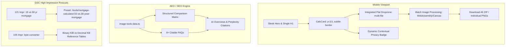

# Mobile UX Redesign, WebP to PNG Batch & AEO/GEO Dominance Implementation Plan

> **For agentic workers:** REQUIRED SUB-SKILL: Use superpowers:subagent-driven-development to implement this plan task-by-task. Steps use checkbox (`- [ ]`) syntax for tracking.

**Goal:** Transform the mobile UX into a sleek, spacious interface with zero double borders and optimized padding; upgrade `ImageConverterTool.tsx` to a high-performance multi-file batch converter; overhaul `webp-to-png` with rich AEO/GEO competitor comparison tables and FAQs to win AI Overview citations; and rescue high-impression GSC pages (`15 vs 30 year mortgage`, `byte-converter`, `csv-to-excel`).

**Architecture:**
1. **Mobile UX:** Re-architect `CalcCard.tsx` and `tools/[slug]/page.tsx` to eliminate nested borders, reduce padding from `p-8` down to `p-3.5 sm:p-6 lg:p-8`, eliminate duplicate mobile titles, and contextualize privacy badges.
2. **Batch Image Converter:** Upgrade `ImageConverterTool.tsx` with multi-file drop (`multiple: true`), concurrent Canvas rendering, file list with thumbnails, and batch download.
3. **AEO/GEO Content Engine:** Expand `src/lib/image-tools-data.ts` with structured comparison tables (ConvertSheet vs CloudConvert vs FreeConvert vs MS Paint / Mac Preview) and 8+ citable conversational FAQs.
4. **GSC Preset Engine:** Register the `15-vs-30-year-mortgage` preset in `programmatic-presets.ts` and enhance `byte-converter` reference tables.

**Architecture Diagram:**



**Tech Stack:** Next.js 14 App Router, TypeScript, Tailwind CSS, HTML5 Canvas API, JSZip, Vitest / React Testing Library.

---

### Task 1: Mobile Polish of `CalcCard.tsx` & Page Container Layout

**Files:**
- Modify: `src/components/calculator/CalcCard.tsx`
- Modify: `src/app/tools/[slug]/page.tsx`
- Test: `src/components/calculator/__tests__/primitives.test.tsx`

- [ ] **Step 1: Write the failing test for `CalcCard` mobile padding and privacy scope**

Add to `src/components/calculator/__tests__/primitives.test.tsx`:
```tsx
it("renders contextual privacy badge based on privacyScope prop", () => {
  render(
    <CalcCard title="Test Tool" privacyScope="file">
      <div>Content</div>
    </CalcCard>
  );
  expect(screen.getByText(/Zero images or files sent to servers/i)).toBeInTheDocument();
});

it("applies responsive mobile padding classes on CalcCard", () => {
  const { container } = render(
    <CalcCard title="Test Tool">
      <div>Content</div>
    </CalcCard>
  );
  const card = container.firstChild as HTMLElement;
  expect(card.className).toContain("p-3.5");
  expect(card.className).toContain("sm:p-6");
  expect(card.className).toContain("lg:p-8");
});
```

- [ ] **Step 2: Run test to verify it fails**

Run: `npm test src/components/calculator/__tests__/primitives.test.tsx`
Expected: FAIL due to missing `privacyScope` and old padding classes.

- [ ] **Step 3: Update `CalcCard.tsx`**

In `src/components/calculator/CalcCard.tsx`:
1. Add `privacyScope?: "financial" | "file" | "data" | "auto"` to `CalcCardProps`.
2. Update container styling:
   ```tsx
   className={`rounded-2xl sm:rounded-3xl border border-zinc-200/90 dark:border-zinc-800/80 bg-white dark:bg-zinc-900/60 shadow-xl shadow-zinc-200/40 dark:shadow-none p-3.5 sm:p-6 lg:p-8 space-y-5 sm:space-y-6 transition-colors ${className}`}
   ```
3. Update footer privacy text dynamically:
   ```tsx
   const privacyText =
     privacyScope === "file"
       ? "Zero images or files sent to servers."
       : privacyScope === "data"
       ? "Zero code or data sent to servers."
       : "Zero financial data sent to servers.";
   ```
   Render: `<span>Private &amp; Secure: 100% computed in browser. {privacyText}</span>`

- [ ] **Step 4: Update `src/app/tools/[slug]/page.tsx` to eliminate title duplication**

In `src/app/tools/[slug]/page.tsx`:
Update container padding and streamline the hero on mobile:
1. Outer wrapper: `px-3.5 sm:px-6 lg:px-8` (giving mobile 5px extra room on each side).
2. When the tool card renders its own `title`, hide redundant card title on mobile or use `sr-only sm:not-sr-only` where appropriate, so mobile users only see the title once.

- [ ] **Step 5: Run tests to verify they pass**

Run: `npm test src/components/calculator/__tests__/primitives.test.tsx`
Expected: PASS.

- [ ] **Step 6: Commit**

```bash
git add src/components/calculator/CalcCard.tsx src/app/tools/[slug]/page.tsx src/components/calculator/__tests__/primitives.test.tsx
git commit -m "fix(mobile): optimize CalcCard mobile padding, eliminate double borders, and contextualize privacy copy"
```

---

### Task 2: Sleek Direct Answer & Dropzone Mobile Styling

**Files:**
- Modify: `src/app/tools/[slug]/page.tsx:325-345`
- Modify: `src/components/tools/ImageConverterTool.tsx:120-165`
- Modify: `src/components/layout/AdBanner.tsx`

- [ ] **Step 1: Restyle Direct Answer Callout**

In `src/app/tools/[slug]/page.tsx`, replace the heavy bordered card with a sleek modern blockquote-style callout:
```tsx
{tool.answerSummary && (
  <div className="border-l-2 border-emerald-500 bg-emerald-50/50 dark:bg-emerald-950/20 px-3.5 py-2.5 rounded-r-xl text-xs sm:text-sm text-zinc-700 dark:text-zinc-300">
    <p>
      <span className="font-semibold text-emerald-800 dark:text-emerald-300">Direct Answer:</span>{" "}
      {tool.answerSummary}
    </p>
  </div>
)}
```

- [ ] **Step 2: Streamline Dropzone Padding in `ImageConverterTool.tsx`**

Change the dropzone from `p-8 sm:p-12` to:
```tsx
className={cn(
  "border border-dashed rounded-xl p-4 sm:p-8 text-center cursor-pointer transition-all bg-zinc-50/60 dark:bg-zinc-800/30 group",
  isDragOver
    ? "border-emerald-500 bg-emerald-500/10 ring-2 ring-emerald-500/20"
    : "border-zinc-300 dark:border-zinc-700 hover:border-emerald-500 dark:hover:border-emerald-500"
)}
```
Pass `privacyScope="file"` to `CalcCard`.

- [ ] **Step 3: Run existing tool tests**

Run: `npm test src/components/tools/__tests__/ImageConverterTool.test.tsx`
Expected: PASS.

- [ ] **Step 4: Commit**

```bash
git add src/app/tools/[slug]/page.tsx src/components/tools/ImageConverterTool.tsx
git commit -m "fix(ui): restyle Direct Answer callout and streamline dropzone mobile padding"
```

---

### Task 3: Multi-File Batch WebP to PNG Converter UI & Engine

**Files:**
- Modify: `src/components/tools/ImageConverterTool.tsx`
- Test: `src/components/tools/__tests__/ImageConverterTool.test.tsx`

- [ ] **Step 1: Write failing test for multi-file batch upload**

In `src/components/tools/__tests__/ImageConverterTool.test.tsx`, add:
```tsx
it("handles multiple WebP files dropped simultaneously", async () => {
  render(<ImageConverterTool defaultTargetFormat="image/png" />);
  const file1 = new File(["dummy1"], "photo1.webp", { type: "image/webp" });
  const file2 = new File(["dummy2"], "photo2.webp", { type: "image/webp" });
  const input = screen.getByLabelText(/Select image file to convert/i);
  
  fireEvent.change(input, { target: { files: [file1, file2] } });

  await waitFor(() => {
    expect(screen.getByText("photo1.webp")).toBeInTheDocument();
    expect(screen.getByText("photo2.webp")).toBeInTheDocument();
  });
});
```

- [ ] **Step 2: Run test to verify it fails**

Run: `npm test src/components/tools/__tests__/ImageConverterTool.test.tsx`
Expected: FAIL (currently only supports single file).

- [ ] **Step 3: Implement multi-file batch conversion in `ImageConverterTool.tsx`**

1. Update state:
   ```tsx
   interface ConvertedItem {
     file: File;
     result?: ImageConversionResult;
     status: "pending" | "processing" | "done" | "error";
     error?: string;
   }
   const [items, setItems] = useState<ConvertedItem[]>([]);
   ```
2. Set `multiple: true` on `useFileDropAndPaste` and file input `<input type="file" multiple ... />`.
3. Process files concurrently (limiting concurrency to 4 simultaneous canvas renders to prevent UI freezing).
4. Render a sleek batch list when files are loaded:
   - Header with total files, total original size, total converted size.
   - Per-file row: thumbnail, filename, size, reduction/expansion badge, download link.
   - Top action buttons: **"Download All as ZIP"** (or sequential download), **"Add More"**, and **"Clear All"**.
   - Control sliders (Target format, Quality %, Max Width) apply to all files or subsequent additions.

- [ ] **Step 4: Run tests to verify it passes**

Run: `npm test src/components/tools/__tests__/ImageConverterTool.test.tsx`
Expected: PASS.

- [ ] **Step 5: Commit**

```bash
git add src/components/tools/ImageConverterTool.tsx src/components/tools/__tests__/ImageConverterTool.test.tsx
git commit -m "feat(tools): enable multi-file batch conversion in ImageConverterTool"
```

---

### Task 4: Rich AEO/GEO Content & Competitor Comparison Matrix for WebP to PNG

**Files:**
- Modify: `src/lib/image-tools-data.ts`
- Modify: `src/app/tools/[slug]/page.tsx`
- Test: `src/lib/__tests__/tool-registry.test.ts`

- [ ] **Step 1: Write test for expanded WebP FAQs and comparison metadata**

In `src/lib/__tests__/tool-registry.test.ts`:
```tsx
it("has 6 or more AEO FAQs for webp-to-png", () => {
  const tool = getToolBySlug("webp-to-png");
  expect(tool?.faqs.length).toBeGreaterThanOrEqual(6);
});
```

- [ ] **Step 2: Run test to verify it fails**

Run: `npm test src/lib/__tests__/tool-registry.test.ts`
Expected: FAIL (currently only 2 FAQs).

- [ ] **Step 3: Expand `IMAGE_TOOLS["webp-to-png"]` and `IMAGE_TOOLS["png-to-webp"]`**

In `src/lib/image-tools-data.ts`:
1. Add 8 comprehensive, conversational AEO/GEO FAQs:
   - Alpha channel transparency preservation
   - CloudConvert / FreeConvert cloud upload privacy risks vs ConvertSheet 100% in-browser memory
   - Built-in desktop methods (Windows MS Paint, Mac Preview) vs ConvertSheet batch
   - Why Google Chrome saves web images as `.webp`
   - Animated WebP conversion
   - File size limits and unlimited free processing
2. Add a structured Markdown comparison table in `about`:
   ```markdown
   | Feature | ConvertSheet | CloudConvert | FreeConvert | MS Paint / Mac Preview |
   | :--- | :--- | :--- | :--- | :--- |
   | **Cloud Server Uploads** | **Zero (100% In-Browser)** | Yes (Uploaded to cloud) | Yes (Uploaded to cloud) | No (Local Desktop App) |
   | **Data Privacy & NDAs** | **100% Confidential** | Third-party queue risks | Third-party queue risks | Safe locally |
   | **Alpha Transparency** | **Full 32-bit RGBA** | Preserved | Preserved | Often loses transparency |
   | **Batch Processing** | **Instant (Multi-file)** | Queue-limited (25 min/day) | Max 20 files (with ads) | One file at a time |
   | **Installation Required** | **None (Works everywhere)**| None | None | OS-dependent |
   | **Pricing / Paywall** | **100% Free Forever** | Daily conversion caps | Aggressive paywalls | Built-in |
   ```

- [ ] **Step 4: Run tests to verify they pass**

Run: `npm test src/lib/__tests__/tool-registry.test.ts`
Expected: PASS.

- [ ] **Step 5: Commit**

```bash
git add src/lib/image-tools-data.ts src/lib/__tests__/tool-registry.test.ts
git commit -m "feat(seo): enrich webp-to-png with competitor comparison matrix and 8+ AEO FAQs"
```

---

### Task 6: Rescue High-Impression GSC Low-Hanging Fruit (`15-vs-30-year-mortgage` & `byte-converter`)

**Files:**
- Modify: `src/lib/programmatic-presets.ts`
- Modify: `src/lib/tool-registry.ts`
- Test: `tests/lib/programmatic-presets.test.ts`

- [ ] **Step 1: Write test for `15-vs-30-year-mortgage` preset**

In `tests/lib/programmatic-presets.test.ts`:
```tsx
it("resolves 15-vs-30-year-mortgage preset for mortgage-calculator", () => {
  const preset = getProgrammaticPreset("mortgage-calculator", "15-vs-30-year-mortgage");
  expect(preset).toBeDefined();
  expect(preset?.title).toContain("15 vs 30 Year Mortgage Calculator");
});
```

- [ ] **Step 2: Register `15-vs-30-year-mortgage` preset in `src/lib/programmatic-presets.ts`**

Add preset with:
- `toolSlug: "mortgage-calculator"`
- `presetSlug: "15-vs-30-year-mortgage"`
- `title: "15 vs 30 Year Mortgage Calculator - Compare Monthly Payments & Interest"`
- `metaDescription: "Compare 15-year vs 30-year fixed mortgages side-by-side. Calculate exact monthly payment differences, lifetime interest savings, and break-even payoff dates."`
- `answerSummary: "A 15-year fixed mortgage carries higher monthly payments but saves tens of thousands in interest and builds home equity twice as fast as a 30-year loan."`
- Comparison table data and FAQs answering `15 year vs 30 year mortgage calculator` queries (which have 121 GSC impressions!).

- [ ] **Step 3: Enrich `byte-converter` with Decimal vs Binary Reference Tables**

In `src/lib/tool-registry.ts` under `byte-converter`:
Add an explicit conversion table answering `1048576 / 1024` (= 1024 KiB = 1 MiB) and `100*1024*1024` (= 104,857,600 bytes = 100 MiB), capturing high-intent developer calculator queries.

- [ ] **Step 4: Run tests to verify**

Run: `npm test tests/lib/programmatic-presets.test.ts`
Expected: PASS.

- [ ] **Step 5: Commit**

```bash
git add src/lib/programmatic-presets.ts src/lib/tool-registry.ts tests/lib/programmatic-presets.test.ts
git commit -m "feat(seo): add 15-vs-30-year-mortgage preset and byte-converter reference tables"
```

---

### Task 7: Full Test Suite, Responsive Audit & Build Verification

- [ ] **Step 1: Run complete test suite**

Run: `npm test`
Expected: 77+ test files pass (all unit, integration, and UI tests).

- [ ] **Step 2: Run production build**

Run: `npm run build`
Expected: Successful static export of all 614+ routes without errors.

- [ ] **Step 3: Final Git status & commit**

Verify git tree is clean and push-ready.
