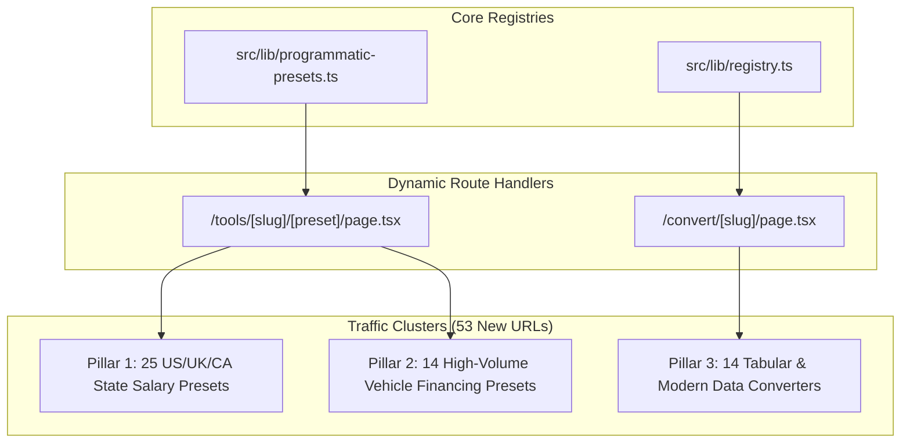

# Traffic Acceleration — 3 Core Pillars Implementation Plan

> **For agentic workers:** REQUIRED SUB-SKILL: Use superpowers:subagent-driven-development to implement this plan task-by-task. Steps use checkbox (`- [ ]`) syntax for tracking.

**Goal:** Scale ConvertSheet's indexable programmatic surface area from 117 to 170+ URLs across our top 3 validated search clusters (State Salaries, Vehicle Financing, and Tabular Converters) to break through the 350 daily impressions plateau.

**Architecture:** We expand `PROGRAMMATIC_PRESETS` in `src/lib/programmatic-presets.ts` with 25 state salary presets and 14 vehicle loan presets. In `src/lib/registry.ts`, we register 14 high-volume tabular and structured data converters with complete SEO metadata, schema generators, and client-side conversion configs.

**Architecture Diagram:**



**Tech Stack:** Next.js 14 App Router, TypeScript, Tailwind CSS, Vitest, React Testing Library.

---

### Task 1: Pillar 1 — US State & Bracket Salary Matrix Expansion

**Files:**
- Modify: `src/lib/programmatic-presets.ts`
- Test: `tests/lib/programmatic-presets.test.ts`

- [ ] **Step 1: Write the failing tests**

In `tests/lib/programmatic-presets.test.ts`, add test cases for Pillar 1 presets:
```typescript
it("resolves newly registered US state and bracket salary presets", () => {
  const florida100k = getProgrammaticPreset("salary-calculator", "florida-take-home-100k");
  expect(florida100k).toBeDefined();
  expect(florida100k?.title).toContain("Florida");
  expect(florida100k?.title).toContain("100k");
  expect(florida100k?.faqs.length).toBeGreaterThanOrEqual(4);

  const washington100k = getProgrammaticPreset("salary-calculator", "washington-take-home-100k");
  expect(washington100k).toBeDefined();
  expect(washington100k?.title).toContain("Washington");

  const pennsylvania75k = getProgrammaticPreset("salary-calculator", "pennsylvania-take-home-75k");
  expect(pennsylvania75k).toBeDefined();
  expect(pennsylvania75k?.title).toContain("Pennsylvania");

  const illinois100k = getProgrammaticPreset("salary-calculator", "illinois-take-home-100k");
  expect(illinois100k).toBeDefined();
  expect(illinois100k?.title).toContain("Illinois");

  const uk45k = getProgrammaticPreset("uk-salary-calculator", "uk-take-home-45k");
  expect(uk45k).toBeDefined();
  expect(uk45k?.title).toContain("£45k");

  const alberta80k = getProgrammaticPreset("canada-paycheck-calculator", "alberta-take-home-80k");
  expect(alberta80k).toBeDefined();
  expect(alberta80k?.title).toContain("Alberta");
});
```

- [ ] **Step 2: Run test to verify it fails**

Run: `npx vitest run tests/lib/programmatic-presets.test.ts`  
Expected: FAIL ("florida100k is undefined").

- [ ] **Step 3: Implement presets in `src/lib/programmatic-presets.ts`**

Register the 25 presets under `salary-calculator`, `uk-salary-calculator`, and `canada-paycheck-calculator`:
- Florida (FL 0% state tax): `florida-take-home-50k`, `florida-take-home-75k`, `florida-take-home-100k`, `florida-take-home-150k`
- Washington (WA 0% state tax): `washington-take-home-100k`, `washington-take-home-150k`
- Pennsylvania (PA 3.07% flat tax): `pennsylvania-take-home-75k`, `pennsylvania-take-home-100k`
- Illinois (IL 4.95% flat tax): `illinois-take-home-75k`, `illinois-take-home-100k`
- Arizona (AZ 2.50% flat tax): `arizona-take-home-75k`, `arizona-take-home-100k`
- Colorado (CO 4.40% flat tax): `colorado-take-home-100k`, `colorado-take-home-150k`
- North Carolina (NC 4.50% flat tax): `north-carolina-take-home-75k`, `north-carolina-take-home-100k`
- Ohio (OH): `ohio-take-home-75k`, `ohio-take-home-100k`
- Georgia (GA): `georgia-take-home-75k`, `georgia-take-home-100k`
- Virginia (VA): `virginia-take-home-100k`, `virginia-take-home-150k`
- UK: `uk-take-home-45k`, `uk-take-home-75k`, `uk-take-home-150k`
- Canada: `alberta-take-home-80k`, `bc-take-home-80k`

Each preset must feature accurate tax deductions, markdown tables with Net Pay / Monthly / Bi-Weekly amounts, initialValues props, and citable FAQs.

- [ ] **Step 4: Run test to verify it passes**

Run: `npx vitest run tests/lib/programmatic-presets.test.ts`  
Expected: PASS.

- [ ] **Step 5: Commit**

```bash
git add src/lib/programmatic-presets.ts tests/lib/programmatic-presets.test.ts
git commit -m "feat(seo): add 25 state and bracket salary presets for US, UK, and Canada"
```

---

### Task 2: Pillar 2 — Vehicle Financing Programmatic Presets

**Files:**
- Modify: `src/lib/programmatic-presets.ts`
- Test: `tests/lib/programmatic-presets.test.ts`

- [ ] **Step 1: Write the failing tests**

In `tests/lib/programmatic-presets.test.ts`, add test cases for vehicle presets:
```typescript
it("resolves newly registered vehicle financing programmatic presets", () => {
  const teslaModelY = getProgrammaticPreset("car-loan-calculator", "tesla-model-y-monthly-payment");
  expect(teslaModelY).toBeDefined();
  expect(teslaModelY?.title).toContain("Tesla Model Y");
  expect(teslaModelY?.faqs.length).toBeGreaterThanOrEqual(4);

  const silverado = getProgrammaticPreset("car-loan-calculator", "chevy-silverado-monthly-payment");
  expect(silverado).toBeDefined();
  expect(silverado?.title).toContain("Silverado");

  const rav4 = getProgrammaticPreset("car-loan-calculator", "toyota-rav4-monthly-payment");
  expect(rav4).toBeDefined();
  expect(rav4?.title).toContain("RAV4");

  const loan84Mo = getProgrammaticPreset("car-loan-calculator", "84-month-car-loan");
  expect(loan84Mo).toBeDefined();
  expect(loan84Mo?.title).toContain("84-Month");

  const zeroDown = getProgrammaticPreset("car-loan-calculator", "zero-down-car-loan");
  expect(zeroDown).toBeDefined();
  expect(zeroDown?.title).toContain("Zero Down");
});
```

- [ ] **Step 2: Run test to verify it fails**

Run: `npx vitest run tests/lib/programmatic-presets.test.ts`  
Expected: FAIL ("teslaModelY is undefined").

- [ ] **Step 3: Implement presets in `src/lib/programmatic-presets.ts`**

Register the 14 vehicle presets under `car-loan-calculator`:
1. `tesla-model-y-monthly-payment` ($44,990, 72 mo, 6.49%, $4,500 down)
2. `chevy-silverado-monthly-payment` ($48,000, 72 mo, 6.49%, $5,000 down)
3. `toyota-rav4-monthly-payment` ($31,500, 60 mo, 5.99%, $3,000 down)
4. `honda-crv-monthly-payment` ($30,800, 60 mo, 5.99%, $3,000 down)
5. `ram-1500-monthly-payment` ($42,000, 72 mo, 6.49%, $4,000 down)
6. `toyota-camry-monthly-payment` ($27,500, 60 mo, 5.99%, $2,500 down)
7. `toyota-tacoma-monthly-payment` ($33,500, 60 mo, 5.99%, $3,500 down)
8. `honda-civic-monthly-payment` ($24,500, 60 mo, 5.99%, $2,000 down)
9. `84-month-car-loan` ($35,000, 84 mo, 7.49%)
10. `48-month-car-loan` ($30,000, 48 mo, 5.49%)
11. `36-month-car-loan` ($25,000, 36 mo, 4.99%)
12. `zero-down-car-loan` ($35,000, $0 down, 60 mo, 6.49%)
13. `50k-car-loan` ($50,000, 60 mo, 6.49%)
14. `40k-car-loan` ($40,000, 60 mo, 6.49%)

Include accurate Markdown amortization tables, initial values matching `CarLoanCalculator` props, and targeted FAQs.

- [ ] **Step 4: Run test to verify it passes**

Run: `npx vitest run tests/lib/programmatic-presets.test.ts`  
Expected: PASS.

- [ ] **Step 5: Commit**

```bash
git add src/lib/programmatic-presets.ts tests/lib/programmatic-presets.test.ts
git commit -m "feat(seo): add 14 high-volume vehicle financing programmatic presets"
```

---

### Task 3: Pillar 3 — High-Demand Tabular & Data Converters

**Files:**
- Modify: `src/lib/registry.ts`
- Test: `src/lib/__tests__/registry.test.ts`

- [ ] **Step 1: Write the failing tests**

In `src/lib/__tests__/registry.test.ts`, add test assertions checking for new tabular converters:
```typescript
it("registers high-volume tabular and structured data converters", () => {
  const expectedSlugs = [
    "tsv-to-csv",
    "csv-to-tsv",
    "tsv-to-excel",
    "excel-to-tsv",
    "sql-to-csv",
    "csv-to-sql",
    "sql-to-json",
    "json-to-sql",
    "ndjson-to-csv",
    "csv-to-ndjson",
    "ndjson-to-excel",
    "yaml-to-excel",
    "excel-to-yaml",
    "parquet-to-json",
  ];

  for (const slug of expectedSlugs) {
    const config = getConverterBySlug(slug);
    expect(config, `Converter ${slug} should exist`).toBeDefined();
    expect(config?.title).toBeTruthy();
    expect(config?.metaDescription).toBeTruthy();
    expect(config?.faq.length).toBeGreaterThanOrEqual(3);
  }
});
```

- [ ] **Step 2: Run test to verify it fails**

Run: `npx vitest run src/lib/__tests__/registry.test.ts`  
Expected: FAIL ("Converter tsv-to-csv should exist").

- [ ] **Step 3: Implement new converters in `src/lib/registry.ts`**

Register all 14 converters with valid extensions, MIME types, SEO descriptions, FAQs, how-to steps, and converter parameters. Ensure DuckDB-Wasm and PapaParse/SheetJS engines support these conversions seamlessly.

- [ ] **Step 4: Run test to verify it passes**

Run: `npx vitest run src/lib/__tests__/registry.test.ts`  
Expected: PASS.

- [ ] **Step 5: Commit**

```bash
git add src/lib/registry.ts src/lib/__tests__/registry.test.ts
git commit -m "feat(converters): register 14 high-volume tabular and data format converters"
```

---

### Task 4: Full Site Build & Static Route Verification

**Files:**
- Modify: N/A (Verification)

- [ ] **Step 1: Run complete test suite**

Run: `npm test`  
Expected: All 700+ tests pass with 0 failures.

- [ ] **Step 2: Run production Next.js build**

Run: `npm run build`  
Expected: Build succeeds, statically generating all 170+ routes cleanly without type errors.

- [ ] **Step 3: Final verification commit & push check**

Run: `git status` to ensure clean working tree.
